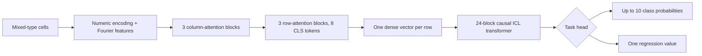
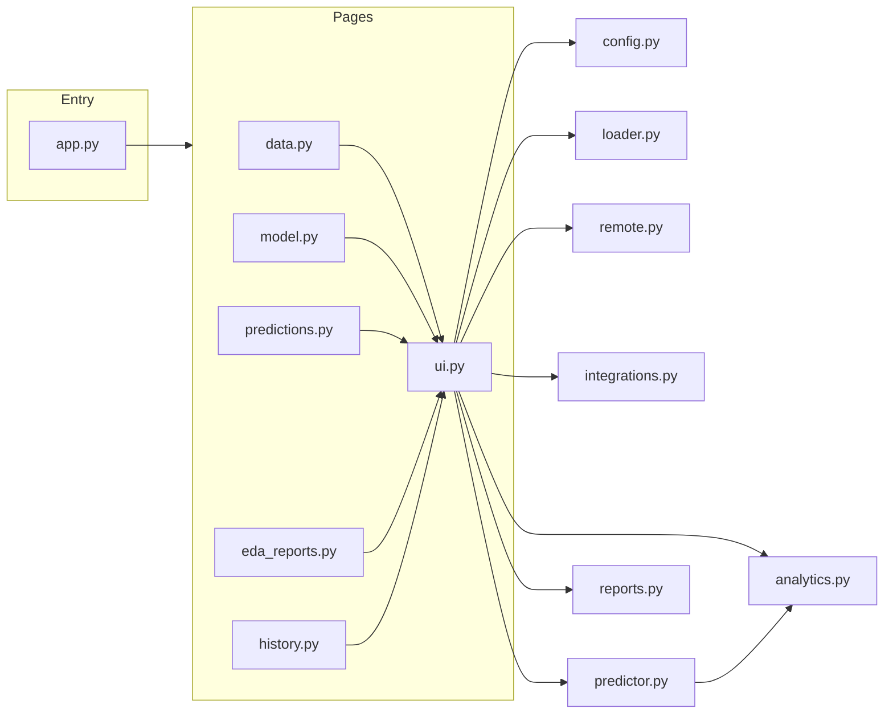

# TabFM Workbench — Complete Guide (Zero to Hero)

> One document, two audiences. Business readers and non-technical users can read
> **Sections 1, 2, 5, 7, 8** and skip the rest. Engineers who want to understand the
> theory and the code should read straight through.

**What this file covers:** what the app is, what problem it solves, the AI theory
behind it (in plain language first, then with the math), a full walkthrough of
every feature and how to use it, how the code implements all of that, the
security/privacy model, and a glossary. It stands on its own — no other file
needs to be open to follow along.

---

## Table of contents

1. [What is this app, and who is it for?](#1-what-is-this-app-and-who-is-it-for)
2. [The idea behind TabFM (in plain language, then in theory)](#2-the-idea-behind-tabfm-in-plain-language-then-in-theory)
3. [How TabFM works under the hood (architecture)](#3-how-tabfm-works-under-the-hood-architecture)
4. [Getting the app running](#4-getting-the-app-running)
5. [The full feature tour — every page, every button](#5-the-full-feature-tour--every-page-every-button)
6. [Under the hood: how the code implements each feature](#6-under-the-hood-how-the-code-implements-each-feature)
7. [Security, privacy, and where your data goes](#7-security-privacy-and-where-your-data-goes)
8. [Licensing and responsible use (read this before showing anyone a demo)](#8-licensing-and-responsible-use-read-this-before-showing-anyone-a-demo)
9. [Testing and contributing](#9-testing-and-contributing)
10. [Glossary](#10-glossary)
11. [Troubleshooting quick table](#11-troubleshooting-quick-table)
12. [Further reading](#12-further-reading)

---

## 1. What is this app, and who is it for?

**In one sentence:** this is a local, private, point-and-click app that lets you
upload a spreadsheet-like table and get predictions (classify rows, or predict a
number) from Google's TabFM model, without writing code and without training a
model yourself.

### Who uses this and why

| If you are... | This app helps you... |
|---|---|
| A business analyst | Upload a CSV (e.g. customer churn, sales history), pick the column you want to predict, and get predictions and accuracy metrics — no data science team required for a first pass. |
| A data scientist / ML engineer | Get an instant zero-shot baseline for a new tabular dataset before building a bespoke pipeline, and compare it against a tuned GBDT. |
| A student / researcher | Learn how a modern "foundation model for tables" behaves, with full visibility into every step (no black box). |
| Someone evaluating TabFM | Try it locally on your own machine, on your own data, without sending anything to a cloud API. |

### What it is **not**

- **Not a production service.** It runs on your own machine at `127.0.0.1` (your computer only — nothing else on the internet can reach it).
- **Not for commercial use.** The underlying TabFM model weights carry a **non-commercial research license** — see [Section 8](#8-licensing-and-responsible-use-read-this-before-showing-anyone-a-demo). This is a hard legal boundary, not a suggestion.
- **Not a training tool.** It does not train, fine-tune, or modify the AI model. It only *uses* it (more on why in Section 2).

### The five things you can do in the app

| Page | What happens there |
|---|---|
| **Data** | Load a table from a file upload, a direct web link, Hugging Face, or Kaggle. |
| **Model** | Tell the app which column you want to predict, and prepare the model. |
| **Predictions** | Get predictions for new rows — in bulk, or one row at a time. |
| **EDA & Reports** | Explore your data visually, and download a shareable report of your results. |
| **History** | Look back at every prediction run you've ever made on this machine. |

Each is covered in full, step by step, in [Section 5](#5-the-full-feature-tour--every-page-every-button).

---

## 2. The idea behind TabFM (in plain language, then in theory)

### 2.1 The plain-language version

Imagine you have a table of past customers — their age, plan, spend, and whether
they churned. Traditionally, to predict churn for a *new* customer, you'd need to
**train** a model: feed it your table, let it learn patterns for hours, save the
trained model to disk, and only then use it to predict.

TabFM skips the "train for hours" step entirely. Instead, at the moment you ask
for a prediction, you hand it **both** your labeled examples (the customers whose
churn outcome you already know) **and** the new customer you want a prediction
for — all in one go. The model reads your examples like a worked example in a
textbook, and then answers the new question by analogy. It never permanently
changes; it just reads your data as *context* each time.

This is called **in-context learning (ICL)**, and doing it with **zero** dataset-specific
training is called **zero-shot**. That's the whole trick — and it's why the "Model"
page in this app never says "Train" — it says **"prepare context"**, because that's
literally all that happens.

> **Zero-shot does not mean "without examples."** It still needs your labeled rows.
> It means it doesn't *learn new parameters* from them — it just reads them as
> input, every single time, like a human expert reading a case file before giving
> an opinion.

### 2.2 The more precise version

A **foundation model** is a single model pretrained across a huge, broad
distribution of tasks so that it generalizes to new tasks without per-task
retraining. For TabFM, Google pretrained it on hundreds of millions of *synthetic*
tables generated from random statistical models — not one fixed business dataset.
At inference time, your table acts like a prompt: labeled rows demonstrate the
pattern, unlabeled rows ask the model to complete it.

Formally, for a labeled context set $\mathcal{D}_c=\{(\mathbf{x}_i,y_i)\}_{i=1}^n$
and an unseen row $\mathbf{x}_*$, a traditional model learns parameters
$\hat\theta$ specific to your dataset:

$$p(y_*\mid\mathbf{x}_*;\hat\theta_{\mathcal{D}_c})$$

TabFM instead keeps its pretrained parameters $\theta$ **frozen** and conditions
on your context directly:

$$p_\theta(y_*\mid\mathbf{x}_*,\mathcal{D}_c)$$

### 2.3 How this compares to a "normal" ML model (like XGBoost)

| Property | Traditional model (e.g. XGBoost/LightGBM) | TabFM in this app |
|---|---|---|
| Adaptation mechanism | Optimizes new decision trees for your data | Conditions a frozen model on your labeled rows |
| Per-dataset weight updates | Yes | No |
| Hyperparameter search | Often needed | Not required |
| Setup time before first prediction | Minutes to hours (training) | Seconds to a couple of minutes (loading a checkpoint) |
| Output | Class/probability or number | Same |
| Best at | Compact, fast, explainable, tunable | Instant baseline with almost no setup |
| Hard limits in this app | Model-dependent | Max 10 classes, max 500 feature columns |

Neither is "better" in general — see the decision table in
[docs/tutorial/01_introduction.md § 8](docs/tutorial/01_introduction.md#8-when-to-use-which-model-family)
for when to reach for which.

### 2.4 Classification vs regression, in one page

| | Classification | Regression |
|---|---|---|
| What you're predicting | A category ("yes/no", "A/B/C") | A number (a price, a score) |
| Hard limit | 2 to 10 distinct categories | Target must be numeric |
| What you get back | A label + a probability for each category | One number |
| Example | "Will this customer churn?" | "What will this house sell for?" |

---

## 3. How TabFM works under the hood (architecture)

*(Business readers can skip to [Section 4](#4-getting-the-app-running) — this
section is for the technically curious.)*

TabFM turns your table into a prediction in five stages:



1. **Fourier features.** Every numeric cell value is expanded into a richer
   periodic representation (sines and cosines at multiple frequencies) instead of
   being fed in raw. This helps the model notice patterns across very different
   value scales.
2. **Column attention.** Cells "look at" each other across the whole column, using
   a *Set Transformer*-style mechanism (256 "induced points" act as a
   cheap summary so this doesn't get expensive as columns grow).
3. **Row compression.** Each row's many cells get compressed into one dense
   vector using 8 learned summary tokens — this is what makes it feasible to feed
   thousands of rows into the next stage.
4. **Rotary position embeddings (RoPE).** Encodes *relative* position so the model
   is aware of row order without hard-coding absolute positions.
5. **Causal ICL masking.** The final 24-block transformer reads your labeled
   context rows first, then predicts each test row — but it is mathematically
   prevented from "peeking" at other test rows' answers. This is the same masking
   trick used in GPT-style language models, applied to rows of a table instead of
   words in a sentence.
6. **Ensemble aggregation.** This app runs **8 slightly different views** of your
   data through the model (different row/column orderings, different samples) and
   averages the results — this reduces the model's sensitivity to arbitrary row
   order and makes predictions more stable.

The full math (Fourier feature formula, attention equations, RoPE, the softmax
classification head, and every metric formula) is written out in
[docs/tutorial/01_introduction.md](docs/tutorial/01_introduction.md) and
[docs/tutorial/04_tabfm_mastery.md](docs/tutorial/04_tabfm_mastery.md) — this
guide summarizes it so you don't have to leave this file, but doesn't repeat
every derivation.

**What TabFM does *not* do:** fine-tune its weights, run gradient descent, save a
customized checkpoint, or support more than 10 classification classes. If you
need any of those, use a traditional model instead (see Section 2.3).

---

## 4. Getting the app running

This is the short version — the full step-by-step with troubleshooting tables is
in [docs/tutorial/02_installation.md](docs/tutorial/02_installation.md).

```powershell
# 1. Get the code and dependencies (uv manages Python + packages for you)
git clone https://github.com/pypi-ahmad/google-tabfm-project.git
cd google-tabfm-project
uv python install 3.12.10
uv sync --locked --extra cpu --extra integrations   # or --extra cu130 for NVIDIA GPU

# 2. Configure
Copy-Item .env.example .env
# Edit .env: review the model license, then set
#   TABFM_ACCEPT_NON_COMMERCIAL_LICENSE=true
#   (only if your intended use is genuinely permitted — see Section 8)

# 3. Run
uv run --env-file .env streamlit run app.py
```

Open `http://127.0.0.1:8501`. Nothing here talks to the internet except: (a)
downloading the TabFM model checkpoint the first time, and (b) whichever data
source you explicitly choose on the Data page.

---

## 5. The full feature tour — every page, every button

The app has one sidebar (always visible) and five pages, in the order you'll
naturally use them.

### 5.0 The sidebar (always visible)

| What you see | What it means |
|---|---|
| **License: Ready / Not configured** | Whether you've acknowledged the TabFM weight license. Model loading is blocked until this says "Ready." |
| **Device preference** | Whether the app will try to use your GPU (`cuda`) or CPU. |
| **Hugging Face / Kaggle: Ready / Not configured** | Whether you've supplied API credentials for those data providers — optional. |
| **HF / Kaggle MCP endpoint** | Whether an optional dataset-discovery server is configured. |
| **"Remote imports require HTTPS"** warning | Tells you whether insecure plain-HTTP downloads are (unusually) enabled. |
| **Start new task** button | Wipes your current target/model/prediction choices but keeps your loaded data and history. Use this to try a different target column on the same data. |

### 5.1 Data page — load your table

This is always your starting point. You can load data from any combination of
five sources, and load multiple files at once:

1. **Local files.** Click **Upload CSV, Parquet, or XLSX files**, pick one or more
   files, then click **Parse uploaded files**. Every file is parsed independently
   — one broken file doesn't stop the good ones from loading. Files bigger than
   the configured limit (500 MB by default) are rejected individually.
2. **Direct URL.** Paste an `https://` link that points *directly* at a `.csv`,
   `.parquet`, or `.xlsx` file (not a web page) and click **Fetch URL**. The app
   refuses non-HTTPS links, links with a username/password embedded, and links
   pointing at your own machine or private network — this is a security
   guardrail, not a bug, if you see it reject something.
3. **Hugging Face Hub.** Search by keyword, pick a dataset repository, list its
   files, and download the one you want. A token (`HF_TOKEN` in `.env`) is
   optional and only needed for private/gated datasets.
4. **Kaggle.** Same idea: search, pick a dataset, list its files, download.
   Requires a Kaggle API token configured in `.env`.
5. **MCP discovery.** An optional "search-only" helper — it can suggest dataset
   names from a Hugging Face or Kaggle discovery server, but it never downloads
   anything itself; you still use options 3/4 above to actually get the file.

Once at least one table is loaded, a dropdown lets you choose the **active
dataset** — this is the one every other page will work with. Switching it clears
any in-progress model/prediction so you never accidentally mix data from two
different tables.

**"Clear loaded datasets"** removes every loaded table and anything derived from
them (but never your saved history — see Section 5.5).

### 5.2 Model page — tell it what to predict

1. Pick your **target column** — the thing you want to predict — from a dropdown.
2. The app suggests **Classification** or **Regression** automatically, with a
   one-line reason (e.g. "Target has 2 integer-like values"). You can override
   this — the app never overrides your domain judgement.
3. Check the summary numbers: labeled rows, feature count, distinct target
   values.
4. Click **Load TabFM and prepare context** (this button is disabled until you've
   acknowledged the license in `.env` — see the sidebar). The first time, this
   downloads a multi-gigabyte model checkpoint, so it can take a few minutes.

At this point the model has "prepared context" — remember, this is *not*
training. It's ready for the Predictions page.

### 5.3 Predictions page — get answers

Two modes, side by side:

**Batch** — predict many rows at once:

- **Blank targets in context dataset**: any row in your active table where the
  target column is empty gets predicted. Useful when your one spreadsheet has
  both known and unknown outcomes mixed together.
- **Separate test file**: upload a second file. If it happens to include the
  target column with real answers, the app shows you accuracy metrics; if not,
  you just get predictions with no metrics (because there's nothing to compare
  against).
- Click **Run batch prediction**. You'll see: any schema warnings (e.g. "this
  column was missing, filled with blank"), metrics (if applicable), the device
  used, how long inference took, a preview table, and a **Download predictions**
  CSV button.

**Single** — a form-based single case:

- The app builds an input field for every feature automatically, matched to its
  type (a dropdown for a Yes/No column, a number box for a numeric column, a date
  picker for dates).
- Fill it in, click **Predict single case**, and get an instant answer — good for
  "what if" exploration, one row at a time.

Every successful prediction (batch or single) automatically saves a report
bundle you can download immediately, and also archives it to **History**
(Section 5.5).

### 5.4 EDA & Reports page — understand your data

"EDA" = Exploratory Data Analysis. This page shows you, without any extra
clicks:

- **Top metrics**: row count, column count, % missing cells, duplicate rows.
- **Schema and quality table**: for every column — its data type, how many values
  are missing, how many distinct values it has, and automatic flags for
  "looks like an ID column" or "looks constant" (both are usually signs to
  exclude a column from prediction).
- **Numeric and categorical summaries**: mean/median/min/max for numbers; most
  common value and its frequency for categories.
- **Univariate charts**: pick any numeric column for a histogram or box plot;
  pick any categorical column for a bar chart of its top 20 values.
- **Bivariate charts**: scatter plot between two numeric columns; box plot of a
  numeric column grouped by a category.
- **Correlation heatmap**: how numeric columns relate to each other (capped at
  the first 20 numeric columns for readability).
- **Target analysis**: a chart specifically for whichever column you chose as
  the prediction target.
- **Download latest report bundle**: the same ZIP generated after your last
  prediction (see Section 5.5), containing an HTML report, a PDF report, the
  predictions CSV, and a metrics JSON file — self-contained, shareable, and
  viewable without this app.

All charts use a deterministic sample (same rows every time, capped at 10,000,
or 5,000 for scatter plots) so large tables stay responsive.

### 5.5 History page — your permanent local record

Every successful prediction (and even failed report-saving attempts) is recorded
here, forever, on your own machine — newest first, 10 per page.

- Pick a run from the dropdown to see its full details: task, target, mode,
  metrics, warnings, latency, device, and status.
- If the run's report bundle still exists on disk, **Download report bundle**
  gives you the same ZIP as before — even weeks later.
- **Clear history** asks for confirmation, then permanently deletes the saved
  index and (best-effort) the report files. This cannot be undone. It never
  touches your currently loaded datasets or downloaded provider files.

> **Why this matters for privacy:** history is **not** automatically cleaned up.
> If you predicted on sensitive data, that data (features, predictions, metrics)
> lives in a ZIP file on your disk until you explicitly clear it. See
> [Section 7](#7-security-privacy-and-where-your-data-goes).

---

## 6. Under the hood: how the code implements each feature

*(This section is for engineers. If you just want to use the app, you can stop
at Section 5.)*

### 6.1 Module map

| File | What it owns | Key exports |
|---|---|---|
| `app.py` | Entry point: page registration, top-level error catching | — |
| `src/tabfm_workbench/config.py` | Environment-backed settings + the license gate | `Settings`, `Settings.assert_model_use_allowed()` |
| `src/tabfm_workbench/loader.py` | Parsing CSV/Parquet/XLSX bytes into DataFrames; splitting context vs test rows | `load_table()`, `load_many()`, `partition_rows()` |
| `src/tabfm_workbench/remote.py` | Fetching a dataset from a direct URL, with SSRF-style guardrails | `fetch_dataset()`, `validate_remote_url()` |
| `src/tabfm_workbench/integrations.py` | Hugging Face / Kaggle / MCP adapters | `download_huggingface_file()`, `download_kaggle_dataset()`, `discover_via_mcp()` |
| `src/tabfm_workbench/predictor.py` | Loading TabFM, preparing context, aligning schemas, predicting | `load_tabfm_predictor()`, `PreparedPredictor` |
| `src/tabfm_workbench/analytics.py` | Pure EDA and evaluation-metric math (no UI, no I/O) | `build_eda_snapshot()`, `evaluate_predictions()` |
| `src/tabfm_workbench/reports.py` | Building the report ZIP + the durable SQLite-backed history | `generate_report_bundle()`, `HistoryRepository` |
| `src/tabfm_workbench/ui.py` | All five Streamlit page bodies + session-state orchestration | `render_data_loading()`, `render_model_context()`, `render_batch_predictions()`, `render_single_prediction()`, `render_eda_reports()`, `render_history()` |
| `app_pages/*.py` | One-liner shims required by Streamlit's multi-page routing; each just calls the matching `ui.py` renderer | — |



### 6.2 Data page → code

`ui.render_data_loading()` (`ui.py:223`) drives all five import paths:

- Local upload → `loader.load_many()` (`loader.py:78`) parses each file
  independently and returns both successes and per-file failures, so one bad file
  never blocks the rest.
- Direct URL → `remote.fetch_dataset()` (`remote.py:66`) first calls
  `validate_remote_url()` (`remote.py:27`), which rejects non-HTTPS, embedded
  credentials, `localhost`, and any hostname whose DNS resolution isn't a fully
  public IP address — before a single byte is requested.
- Hugging Face / Kaggle → thin wrappers in `integrations.py` around the official
  `huggingface_hub` and `kaggle` client libraries. `normalize_dataset_filename()`
  (`integrations.py:20`) strips any path traversal from a Hugging Face filename
  before it's written to disk.
- MCP → `discover_via_mcp()` (`integrations.py:144`) opens a short-lived MCP
  session and will call **only** a tool literally named `search_datasets`,
  `dataset_search`, or `list_datasets` — nothing else, by allowlist, not by
  convention.

Every successful parse calls `ui.register_artifact_state()` (`ui.py:114`), which
also handles filename collisions (`train.csv`, `train (2).csv`, …).

### 6.3 Model page → code

`ui.render_model_context()` (`ui.py:342`):

1. Calls `predictor.suggest_task()` (`predictor.py:62`) to guess classification vs
   regression from the target column's values.
2. Computes `predictor.context_fingerprint()` (`predictor.py:92`) — a SHA-256
   hash of the feature schema, dtypes, and values — and stores it in
   `st.session_state`. Any change in the underlying data invalidates a previously
   prepared model automatically, so you can never accidentally predict against
   stale context.
3. On button click, calls `predictor.load_tabfm_predictor()` (`predictor.py:211`),
   which imports the official `tabfm` package and constructs an 8-member ensemble
   (`n_estimators=8`) `TabFMClassifier`/`TabFMRegressor`.
4. Calls `PreparedPredictor.prepare()` (`predictor.py:112`), which validates
   context size, feature count, and class count *before* calling the real
   `estimator.fit(...)` — this is the "prepare context, don't train" step from
   Section 2.

### 6.4 Predictions page → code

`ui.render_batch_predictions()` / `ui.render_single_prediction()`
(`ui.py:414`, `ui.py:465`) both funnel into `PreparedPredictor.predict()`
(`predictor.py:140`), which:

1. Aligns incoming feature columns to the exact schema seen during `prepare()`
   via `align_features()` (`predictor.py:80`) — reordering, filling missing
   columns with null (with a warning), dropping extras (with a warning).
2. Times the actual model call with `perf_counter()` and reports it as
   `latency_ms`.
3. If expected labels are available, calls `analytics.evaluate_predictions()`
   (`analytics.py:166`) to compute the full metrics table.

Every submit action then calls `ui._archive_prediction()` (`ui.py:687`), which
builds a `ReportInput` and calls `reports.generate_report_bundle()`
(`reports.py:154`) and `HistoryRepository.create()` (`reports.py:215`) — this is
where the ZIP and the permanent history row are actually written.

### 6.5 EDA & Reports page → code

`analytics.build_eda_snapshot()` (`analytics.py:73`) is pure, deterministic, and
side-effect-free — it never mutates your DataFrame and always samples with a
fixed `random_state=42`, which is why re-opening this page shows identical
charts. `ui.py` caches its result per-DataFrame with `@st.cache_data` so
switching tabs doesn't recompute it.

### 6.6 History page → code

`reports.HistoryRepository` (`reports.py:199`) is a small SQLite database
(`history.sqlite3`) that indexes metadata, plus a `bundles/` folder of ZIP files.
Every write is transactional: `create()` (`reports.py:215`) begins a SQLite
transaction, writes the ZIP to a temp file first, and only renames it into place
*after* the database commit succeeds — so a crash mid-write can never leave a
database row pointing at a missing or half-written file. `_safe_bundle_path()`
(`reports.py:458`) double-checks every bundle path stays inside the history
folder and ends in `.zip`, closing off path-traversal by construction, not by
convention.

---

## 7. Security, privacy, and where your data goes

This app is designed for **one trusted person on their own computer** — not a
hosted multi-user service. That single assumption shapes every decision below.

| Concern | How this app handles it |
|---|---|
| Who can reach this app? | Only your own computer. Streamlit binds to `127.0.0.1` (loopback), not `0.0.0.0` — nothing outside your machine can connect. |
| Where do credentials live? | Only in environment variables / your local `.env` file. They are never displayed in the UI, never written to a report, and never logged. |
| What happens to a direct-URL download? | Checked *before* any request: HTTPS only (by default), no `localhost`/private IPs, no embedded username/password, no automatic redirects, a byte-size cap, and a time limit. |
| What happens to my uploaded data? | Kept in memory for the session; nothing is written to disk from an upload unless you run a prediction (see below). |
| What happens after I run a prediction? | The features, prediction, metrics, and dataset name are saved into a ZIP under `data/sessions/history/`, indexed in a local SQLite file — **forever, until you clear it**. There is no automatic expiry. |
| Can I delete this history? | Yes — the History page's **Clear history** button, after a confirmation dialog. |
| Does anything get sent to the cloud automatically? | Only the one-time TabFM model checkpoint download (from Hugging Face) and whichever data-provider action you explicitly click (Hugging Face/Kaggle/direct URL). Nothing else. |
| Is MCP a way for an attacker to make this app do things? | MCP is restricted to three specific read-only tool names and is never used to download files directly — the download always happens through the trusted Hugging Face/Kaggle client libraries. |

**Bottom line for anyone handling sensitive data:** don't load truly sensitive
data into this app unless you're comfortable with it sitting, unencrypted, in a
local folder on your workstation until you manually clear history — and you
trust your workstation's own access controls (login password, disk encryption,
etc.) as the only barrier. This is documented in full in
[SECURITY.md](SECURITY.md).

---

## 8. Licensing and responsible use (read this before showing anyone a demo)

There are **two separate licenses** in play, and mixing them up is the single
easiest way to get this wrong:

| What | License | What it means |
|---|---|---|
| This app's own source code | Apache License 2.0 | You can read, modify, and redistribute the *app* freely. |
| The TabFM model weights (what actually makes predictions) | **TabFM Non-Commercial License v1.0** | Testing, evaluation, and research use **only**. **No commercial use. No production use. No revenue-generating activity.** |

The app enforces this at a technical level: the **Model** page's "prepare
context" button stays disabled until you explicitly set
`TABFM_ACCEPT_NON_COMMERCIAL_LICENSE=true` in your local `.env` file — and that
flag is a **local safety reminder, not a legal opinion and not a grant of
rights**. Setting it to `true` doesn't change what the license actually permits;
read the license yourself first.

**In practice, this means:** do not use this app's predictions to make a real
commercial decision (pricing, hiring, credit, production automation, a
customer-facing feature, etc.). It's built for learning, evaluation, and
research — full stop.

---

## 9. Testing and contributing

```powershell
uv sync --locked
uv run ruff check .      # lint
uv run mypy               # type-check
uv run pytest -p no:cacheprovider   # tests — no TabFM checkpoint download required
```

The automated test suite never downloads the (multi-gigabyte) TabFM checkpoint —
model-facing tests use deterministic fake estimators that implement the same
`fit`/`predict`/`predict_proba` shape (see the `Estimator` typing contract in
`predictor.py:23`). See [CONTRIBUTING.md](CONTRIBUTING.md) for the full
contribution workflow, and [CODE_OF_CONDUCT.md](CODE_OF_CONDUCT.md) before
opening an issue or PR.

---

## 10. Glossary

| Term | Plain-language meaning |
|---|---|
| **Tabular foundation model** | One pretrained AI model, built to handle *any* table-shaped prediction problem, instead of being trained from scratch per dataset. |
| **In-context learning (ICL)** | Giving a model labeled examples *as part of the input* at prediction time, instead of updating its internal parameters. |
| **Zero-shot** | Making a prediction without any dataset-specific training step (but still using labeled examples as context — see above). |
| **`fit()` (in this app)** | Prepares TabFM's preprocessing and reads your labeled rows as context. It does **not** train or change the model's weights. |
| **Context rows** | The labeled rows you're using as "worked examples" for the model. |
| **Test rows** | The unlabeled rows you want a prediction for. |
| **Ensemble (8-member)** | Running 8 slightly varied versions of the same prediction and averaging them, to reduce noise from arbitrary row/column order. |
| **Fourier features** | A way of representing a number as a mix of waves (sines/cosines) instead of a single raw value, which helps a neural network notice patterns at different scales. |
| **Column attention** | The part of the model where cells in the same column "compare notes" with each other. |
| **Causal masking** | A rule that stops the model from "cheating" by looking at answers it hasn't been given yet. |
| **RoPE (Rotary Position Embedding)** | A technique for telling the model the relative order of rows, without hard-coding absolute positions. |
| **MCP (Model Context Protocol)** | A standard way for this app to ask an external server "what datasets do you have?" — used here only for read-only discovery. |
| **SSRF (Server-Side Request Forgery)** | An attack where a server is tricked into fetching an internal/private address instead of the intended public one. This app's direct-URL feature specifically guards against it (Section 7). |
| **Bus factor** *(dev term, not app feature)* | How many people could disappear before a piece of code has no remaining maintainer — not applicable yet, since this repository has no commit history. |

---

## 11. Troubleshooting quick table

| Symptom | What it usually means | What to do |
|---|---|---|
| "Prepare a model context first" | You skipped the Model page, or changed data/target after preparing | Go to Model, prepare context again |
| Model button stays greyed out | License not acknowledged | Set `TABFM_ACCEPT_NON_COMMERCIAL_LICENSE=true` in `.env` and restart |
| "Only HTTPS dataset URLs are allowed" | You pasted an `http://` link | Use `https://`, or find the direct file link (not a webpage) |
| "Private or local network dataset URLs are not allowed" | The URL resolves to your own machine or a private network | This is intentional — use a real public dataset URL |
| Classification button won't proceed | Target has fewer than 2 or more than 10 distinct values | Pick a different target, or use Regression instead |
| Predictions are extremely slow | Running on CPU instead of GPU | Expected — CPU inference of this model is slow; reduce context size or use a compatible NVIDIA GPU |
| "The report bundle became unavailable" | The ZIP file was deleted/moved outside the app | The metadata is still visible in History, but the file itself is gone |

For the exhaustive troubleshooting tables (installation, credentials, memory
tuning), see [docs/tutorial/02_installation.md](docs/tutorial/02_installation.md)
and [docs/tutorial/04_tabfm_mastery.md](docs/tutorial/04_tabfm_mastery.md).

---

## 12. Further reading

| Document | Best for |
|---|---|
| [README.md](README.md) | Quick project overview and quick-start commands |
| [docs/tutorial/01_introduction.md](docs/tutorial/01_introduction.md) | Full mathematical treatment of TabFM's architecture |
| [docs/tutorial/02_installation.md](docs/tutorial/02_installation.md) | Exhaustive installation/credential setup + troubleshooting |
| [docs/tutorial/03_data_handling.md](docs/tutorial/03_data_handling.md) | Deep dive on data ingestion rules and schema alignment |
| [docs/tutorial/04_tabfm_mastery.md](docs/tutorial/04_tabfm_mastery.md) | Full metric formulas, evaluation protocol, and worked examples |
| [docs/architecture.md](docs/architecture.md) | Package boundaries and security-decision rationale, for maintainers |
| [SECURITY.md](SECURITY.md) | Full security policy and vulnerability reporting process |
