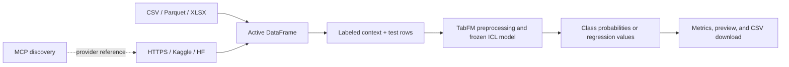

# TabFM Local Research Workbench

[](https://www.python.org/)
[](https://streamlit.io/)
[](https://docs.astral.sh/uv/)
[](https://github.com/pypi-ahmad/google-tabfm-project/actions/workflows/ci.yml)
[](LICENSE)
[](https://huggingface.co/google/tabfm-1.0.0-pytorch/blob/main/LICENSE)

A local-first Streamlit interface for zero-shot tabular classification and regression with
[Google Research TabFM](https://github.com/google-research/tabfm). Load tables from local files,
URLs, Kaggle, or Hugging Face; prepare labeled rows as in-context examples; then run batch or
single-row predictions without dataset-specific weight training.

> [!WARNING]
> **Research and evaluation only.** This repository's original source and documentation are
> Apache-2.0 licensed, but TabFM pretrained weights use the
> [TabFM Non-Commercial License v1.0](https://huggingface.co/google/tabfm-1.0.0-pytorch/blob/main/LICENSE).
> The weights prohibit commercial and production use. The app blocks model loading until you
> explicitly acknowledge those terms.

## Why this workbench?

| Capability | Behavior |
|---|---|
| Mixed tabular data | Numerical, categorical, Boolean, and datetime-aware preprocessing |
| Multiple sources | CSV, Parquet, XLSX, direct HTTPS, Kaggle, Hugging Face, and MCP discovery |
| Two tasks | Classification with 2–10 classes and numeric regression |
| In-context adaptation | `fit()` prepares encoders and labeled context; pretrained weights remain frozen |
| Prediction modes | Blank-target rows, separate test files, and typed manual cases |
| Evaluation | Accuracy/log loss or MAE/RMSE/R² when held-out labels are available |
| Local-first security | Loopback binding, environment-only secrets, bounded URL downloads, local artifacts |
| Reproducibility | Python 3.12.10, uv lockfile, deterministic eight-member ensemble |

## How it works



TabFM reframes tabular prediction as in-context learning: labeled rows and new test rows form one
inference problem for a frozen pretrained model. See the
[Google Research overview](https://research.google/blog/introducing-tabfm-a-zero-shot-foundation-model-for-tabular-data/)
and [official PyTorch model card](https://huggingface.co/google/tabfm-1.0.0-pytorch).

## Quick start

### 1. Clone and install

```powershell
git clone https://github.com/pypi-ahmad/google-tabfm-project.git
Set-Location google-tabfm-project
uv python install 3.12.10

# Choose one runtime:
uv sync --locked --extra cu130 --extra integrations  # NVIDIA CUDA 13.0
# uv sync --locked --extra cpu --extra integrations  # CPU fallback
```

On macOS/Linux, replace `Set-Location` with `cd`. CPU inference is supported but can be very slow.

### 2. Configure local settings

```powershell
Copy-Item .env.example .env
```

```bash
cp .env.example .env
```

Review the model-weight license. Only for a permitted use, change this local setting:

```dotenv
TABFM_ACCEPT_NON_COMMERCIAL_LICENSE=true
```

Optional provider credentials are read from `.env`/environment only:

```dotenv
HF_TOKEN=
KAGGLE_API_TOKEN=
KAGGLE_USERNAME=
KAGGLE_KEY=
```

Never commit `.env`; it is ignored by Git.

### 3. Run

```powershell
uv run --env-file .env streamlit run app.py
```

Open `http://127.0.0.1:8501` if the browser does not launch automatically.

### 4. Predict

1. Load one or more datasets in **Data Loading** and select the active table.
2. Choose a target and task in **Model & Context**, then prepare labeled context.
3. Predict blank-target rows or upload a separate test table in **Batch Predictions**.
4. Build a typed row interactively in **Single Test Case**.
5. Inspect probabilities/metrics and download predictions as CSV.

## Zero-to-Master tutorial

Open the [Interactive HTML edition](index.html) for searchable chapters, installation tracks,
rendered equations and diagrams, theme controls, and copyable code. Serve the repository with
`uv run python -m http.server` for the complete CDN-enhanced experience.

| Chapter | Outcome |
|---|---|
| [01 — Introduction](docs/tutorial/01_introduction.md) | Understand TabFM, GBDTs, ICL, architecture equations, limits, and feasibility |
| [02 — Installation](docs/tutorial/02_installation.md) | Configure uv/Conda, CPU/CUDA, `.env`, Kaggle, Hugging Face, and MCP safely |
| [03 — Data Handling](docs/tutorial/03_data_handling.md) | Import local/remote datasets, validate schemas, and separate context from test rows |
| [04 — TabFM Mastery](docs/tutorial/04_tabfm_mastery.md) | Prepare context, predict, interpret metrics, diagnose failures, and evaluate responsibly |

## Runtime limits

| Constraint | Workbench setting |
|---|---:|
| Classification classes | 2–10 |
| Feature columns | 1–500 |
| Context rows per ensemble member | Up to 5,000 |
| Ensemble members | 8 |
| Upload/download size | 500 MB by default |
| Checkpoint disk size | Approximately 6.6 GB per task |
| Model use | Non-commercial, non-production only |

Memory depends on context rows, features, test rows, ensemble state, and device. Start small and
increase deliberately. Changing the active data, target, task, or context invalidates prepared
prediction state.

## Security model

- Streamlit binds to `127.0.0.1`, not all network interfaces.
- Credentials stay in environment variables or `.env` and are never rendered or logged.
- Direct imports require HTTPS by default, reject private/local destinations and embedded
  credentials, disable redirects, and enforce time/byte limits.
- Provider downloads stay under dedicated workspace directories; selected Hugging Face filenames
  are normalized before their workspace copy.
- MCP endpoints are optional and restricted to allowlisted read-only discovery tools.
- Raw datasets, labels, predictions, and secrets are not written to application logs.

See [architecture and security decisions](docs/architecture.md) and
[the security policy](SECURITY.md).

## Repository structure

```text
.
├── app.py                       # Streamlit entry point
├── src/tabfm_workbench/
│   ├── config.py                # Validated environment settings and license gate
│   ├── loader.py                # CSV/Parquet/XLSX loading and row partitioning
│   ├── remote.py                # Bounded HTTPS retrieval
│   ├── integrations.py          # Kaggle, Hugging Face, and MCP adapters
│   ├── predictor.py             # TabFM preparation, alignment, metrics, prediction
│   └── ui.py                    # Streamlit views and session orchestration
├── docs/
│   ├── architecture.md
│   └── tutorial/                # Four-part Zero-to-Master guide
├── tests/                       # Unit and Streamlit smoke tests using deterministic fakes
├── pyproject.toml
└── uv.lock
```

## Development

Model checkpoints are not downloaded by the automated suite.

```powershell
uv sync --locked
uv run ruff check .
uv run mypy
uv run pytest -p no:cacheprovider
```

Documentation checks run in CI with Markdownlint and Lychee. Contributions must not include
credentials, private datasets, generated predictions, or downloaded checkpoints.

See [CONTRIBUTING.md](CONTRIBUTING.md) for the complete workflow.

## Status and limitations

- TabFM is not an officially supported Google product.
- This repository is a local research workbench, not a production service.
- Task-specific fine-tuning, checkpoint writing, and derivative-model distribution are unsupported.
- Direct URL DNS validation cannot fully prevent DNS rebinding; use trusted sources only.
- Full model integration tests are omitted because each task checkpoint is approximately 6.6 GB.
- Performance, calibration, and fairness must be evaluated on representative held-out data.

## Citation

Use [CITATION.cff](CITATION.cff) to cite this workbench. Cite TabFM separately using the attribution
provided in the [official model card](https://huggingface.co/google/tabfm-1.0.0-pytorch#citation).

## Contributing and conduct

Contributions are welcome within the research-only scope. Read
[CONTRIBUTING.md](CONTRIBUTING.md), [CODE_OF_CONDUCT.md](CODE_OF_CONDUCT.md), and
[SECURITY.md](SECURITY.md) before opening an issue or pull request.

## License

Original workbench source and documentation: [Apache License 2.0](LICENSE).

Third-party TabFM source and pretrained weights retain their own terms. In particular, the weights
are governed by the TabFM Non-Commercial License v1.0. See
[THIRD_PARTY_NOTICES.md](THIRD_PARTY_NOTICES.md). Nothing in this repository relicenses or grants
additional rights to those weights.
