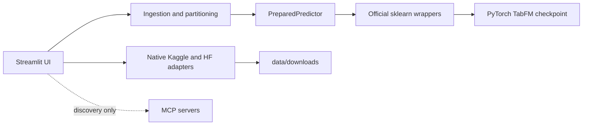

# Architecture

## Runtime boundaries

Single-process modular monolith keeps tabular data and inference local. Streamlit session state owns
the active table, selected source, prepared model session, and prediction result. Model objects use
`st.cache_resource`; uploaded tables remain per-session.

## Inference sequence

1. Load table with pandas using extension-specific parser.
2. Select target. Labeled rows become context; blank target rows, separate files, or editor rows
   become tests.
3. Validate identical ordered feature schemas, at most 500 features, and at most 10 classes.
4. Load `tabfm_v1_0_0_pytorch.load(model_type=..., device=...)`.
5. Construct official classifier/regressor with 8 estimators, batch size 1, maximum 5,000 context
   rows, deterministic seed, context caching, KV quantization, and CPU cache offload.
6. Call wrapper `fit(context_features, context_target)` to prepare preprocessing and context.
7. Call `predict`; classification also calls `predict_proba` and labels columns from `classes_`.

Official preprocessing handles categorical ordinal encoding, numeric mean imputation, datetime
expansion, constant-column removal, standardization, outlier clipping, feature permutations, class
shifts, and regression target standardization/inversion.

## Security decisions

- Loopback binding only.
- Environment-only credentials; no secret values rendered or logged.
- URL ingestion permits HTTPS, rejects embedded credentials, localhost, and non-global literal IPs,
  disables redirects, applies timeouts, and enforces declared plus streamed byte limits.
- Provider downloads stay under dedicated workspace directories; selected Hugging Face filenames
  are normalized before their workspace copy.
- MCP tool calls are allowlisted to dataset-search names; no MCP write/download tools are called.
- Model loading requires explicit non-commercial license acknowledgement.

## Package boundaries

| Module | Responsibility |
|---|---|
| `config.py` | Validated environment settings and license gate |
| `loader.py` | Multi-file CSV/Parquet/XLSX parsing and context/test partition |
| `remote.py` | Bounded direct HTTPS retrieval |
| `integrations.py` | Kaggle, Hugging Face, and discovery-only MCP adapters |
| `predictor.py` | Task suggestion, schema alignment, preparation, metrics, prediction |
| `app.py` | Four-step UI and session orchestration |

## Residual constraints

Domain-name DNS rebinding cannot be fully prevented by HTTPX alone; direct URL ingestion should
remain local/trusted-user only. CPU inference may be impractically slow. GPU memory depends strongly
on context rows, columns, test rows, and ensemble count. Checkpoint download requires Hugging Face
network access and acceptance of its upstream terms.
