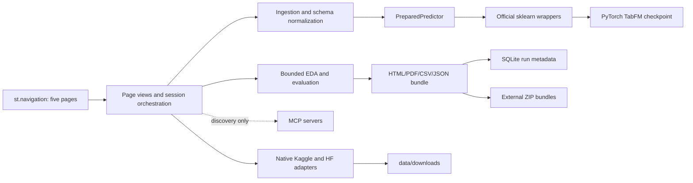

# Architecture

## Runtime boundaries

This is a single-process, local research workbench. `app.py` uses `st.navigation` to expose exactly
five pages: **Data**, **Model**, **Predictions** (Batch and Single), **EDA & Reports**, and
**History**. Page modules are deliberately thin; domain behavior remains in `src/tabfm_workbench`.
Uploaded tables and task state remain per Streamlit session, while model objects use
`st.cache_resource` and EDA snapshots use a bounded `st.cache_data` cache.

## State and persistence boundaries

- **Clear loaded datasets** removes loaded tables plus all in-memory state derived from them. It
  does not remove provider downloads or durable history.
- **Start new task** resets target/task widgets, prepared context, predictions, and current report
  references, but retains loaded tables and durable history.
- **Clear history** transactionally removes indexed run metadata, then best-effort deletes its ZIP
  bundles. Locked bundles can remain orphaned and produce UI cleanup warnings; after closing file
  holders, users must manually remove warned ZIPs or the history directory. It does not clear
  session datasets or provider downloads.

History defaults to `data/sessions/history` and is configurable with `TABFM_HISTORY_DIR`.
`history.sqlite3` stores normalized metadata; self-contained bundles live separately as
`bundles/<run-id>.zip`, avoiding large BLOBs and making artifact downloads direct. Records are
newest-first and paginated 10 per page. Storage has no TTL or automatic eviction, so users must
explicitly clear it and treat it as potentially sensitive local data.

An available run reserves metadata inside `BEGIN IMMEDIATE`, publishes a flushed temporary ZIP by
atomic rename, and commits. Failure rolls back metadata and removes only the uncommitted canonical
file. A report-generation/storage error can instead create a `failed` metadata-only record while
leaving predictions usable. Missing, corrupt, unsafe, or malformed stored artifacts materialize as
`unavailable`; history stays browsable but download is disabled. Clearing commits metadata deletion
before best-effort bundle cleanup, reporting any orphan cleanup failures.

## Inference and schema sequence

1. Parse CSV, Parquet, or XLSX with its extension-specific pandas reader.
2. Select a target. Nonblank targets become context; blank-target rows, separate files, or editor
   rows become test cases.
3. Normalize prediction input to the exact prepared feature order. Missing features are added as
   null with warnings; extra features are ignored with warnings. Duplicate names, zero features,
   more than 500 features, and invalid targets/classes are rejected.
4. Load `tabfm_v1_0_0_pytorch.load(model_type=..., device=...)` after explicit license acceptance.
5. Construct the official classifier/regressor with 8 estimators, batch size 1, at most 5,000
   context rows, deterministic seed, context caching, KV quantization, and CPU cache offload.
6. Call `fit(context_features, context_target)` to prepare preprocessing and frozen context, then
   `predict`; classification also calls `predict_proba` and uses `classes_` for probability names.

Official preprocessing handles categorical ordinal encoding, numeric mean imputation, datetime
expansion, constant-column removal, standardization, outlier clipping, feature permutations, class
shifts, and regression-target normalization/inversion. Switching active dataset, target, task, or
context invalidates all dependent prepared state rather than silently reusing a stale schema.

## Analytics and reports

`analytics.py` owns pure EDA snapshots and evaluation diagnostics. Full-table quality summaries are
combined with deterministic samples capped at 10,000 rows for charts, 5,000 for scatter plots, and
20 numeric columns for correlations. Classification adds balanced and macro metrics, MCC,
baselines, confusion/per-class tables, and probability diagnostics; regression adds baseline/error,
variance, residual, comparison, and quantile diagnostics. Undefined metrics become warnings.

After every successful Batch or Single prediction action, `ui.py` creates a report automatically.
Each deterministic ZIP contains exactly `report.html`, `report.pdf`, `predictions.csv`, and
`metrics.json`. Altair plus `vl-convert-python` render charts and ReportLab renders PDF. The tradeoff
is a larger local dependency surface and rendering cost in exchange for offline, self-contained
artifacts that do not send data to an external reporting service.

## Security decisions

- Loopback binding only; this is not a hosted or production architecture.
- Environment-only credentials; no secret values are rendered, stored in reports, or logged.
- URL ingestion permits HTTPS, rejects embedded credentials, localhost, and non-global literal IPs,
  disables redirects, applies timeouts, and enforces declared plus streamed byte limits.
- Provider downloads stay under dedicated workspace directories; selected Hugging Face filenames
  are normalized before their workspace copy.
- MCP calls are allowlisted, read-only dataset discovery; native provider adapters perform downloads.
- Model loading requires explicit acknowledgement of the TabFM Non-Commercial License. Weights are
  limited to non-commercial, non-production research/evaluation use.

## Package boundaries

| Module | Responsibility |
|---|---|
| `config.py` | Validated environment settings, paths, limits, and license gate |
| `loader.py` | Multi-file parsing and context/test partitioning |
| `remote.py` | Bounded direct HTTPS retrieval |
| `integrations.py` | Kaggle, Hugging Face, and discovery-only MCP adapters |
| `predictor.py` | Task suggestion, schema alignment, preparation, metrics, and prediction |
| `analytics.py` | Bounded EDA snapshots and expanded evaluation diagnostics |
| `reports.py` | Deterministic report generation and transactional local history |
| `ui.py` | Five-page views and session-state transitions |
| `app.py` | `st.navigation` entry point and shared page framing |

## Residual constraints

Domain-name DNS rebinding cannot be fully prevented by HTTPX alone; direct URL ingestion remains a
trusted-local-user feature. CPU inference may be impractically slow. GPU memory depends strongly on
context rows, columns, test rows, and ensemble count. Checkpoint download requires Hugging Face
network access and acceptance of upstream terms. Permanent history has no automatic retention or
encryption layer; workstation access controls and explicit cleanup remain the user's responsibility.
