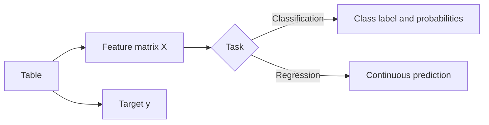
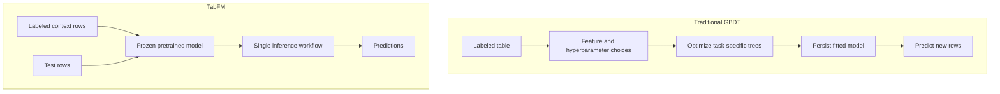
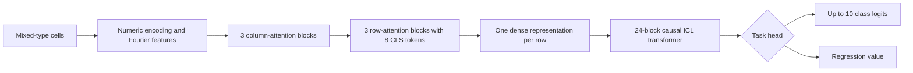

# 01 — TabFM Foundations: From Gradient-Boosted Trees to In-Context Learning

> [!WARNING]
> TabFM's source code is Apache-2.0 licensed, but its pretrained weights use the
> **TabFM Non-Commercial License v1.0**. The weights may be used only for testing,
> evaluation, or research that is not tied to commercial gain or production use.
> Read the [official weight license][tabfm-weight-license] before downloading them.

[← Tutorial index](../../README.md#zero-to-master-tutorial) ·
[Next: Installation →](02_installation.md)

## What you will learn

By the end of this chapter, you will be able to:

1. distinguish a **tabular foundation model** from a task-specific supervised model;
2. explain why TabFM's `fit()` call is not fine-tuning;
3. trace a table through Fourier features, column attention, row compression, and the
   in-context-learning transformer;
4. compare TabFM with XGBoost and LightGBM without treating either family as universally superior;
5. estimate whether your dataset and hardware fit this workbench's operating envelope.

## 1. Tabular learning in one picture

Tabular prediction maps a row of heterogeneous features to either a discrete class or a
continuous value. A table can contain numerical, categorical, Boolean, and datetime columns;
unlike text, its row and column order usually carries no semantic meaning.

Let a labeled context dataset be

$$
\mathcal{D}_{c}=\{(\mathbf{x}_i,y_i)\}_{i=1}^{n}
$$

and let $\mathbf{x}_*$ be an unseen row. Both a GBDT and TabFM estimate a conditional outcome,
but they obtain task knowledge differently:

$$
\underbrace{p(y_*\mid\mathbf{x}_*;\hat{\theta}_{\mathcal{D}_c})}_{\text{task-specific training}}
\qquad\text{versus}\qquad
\underbrace{p_{\theta}(y_*\mid\mathbf{x}_*,\mathcal{D}_c)}_{\text{frozen model + context}}.
$$

In the left expression, training changes parameters $\hat{\theta}$ for this dataset. In the
right expression, TabFM keeps pretrained parameters $\theta$ frozen and supplies labeled rows as
part of the inference context. Google describes this as **zero-shot in-context learning (ICL)**:
the context defines the new prediction problem without updating model weights
([Google Research overview][google-blog], [official repository][tabfm-repo]).

## 2. What is a tabular foundation model?

A **foundation model** is pretrained across a broad task distribution so that one fixed model can
adapt to new tasks. For TabFM, each task is itself a table. Pretraining uses hundreds of millions
of synthetic datasets generated from **structural causal models (SCMs)**, rather than one fixed
business dataset. At inference time, a new table acts like a prompt: labeled rows demonstrate the
relationship, and unlabeled rows ask the model to complete it
([official model card][tabfm-model-card]).

| Property | Task-specific GBDT | TabFM v1.0.0 |
|---|---|---|
| Adaptation mechanism | Optimize new trees and leaf values | Condition frozen weights on labeled rows |
| Per-dataset weight updates | Yes | No |
| Hyperparameter search | Often valuable | Not required for basic inference |
| Feature engineering | Often useful and domain-specific | Built-in mixed-type preprocessing and learned interactions |
| Output | Class/score or continuous value | Class probabilities/labels or continuous value |
| Strength | Efficient, mature, explainable tooling | Immediate zero-shot baseline with little task-specific work |
| Main cost | Training/tuning lifecycle | Large checkpoint and context-dependent inference memory |
| Hard task limits here | Model-dependent | At most 10 classes; workbench caps 500 features |

> [!IMPORTANT]
> **Zero-shot** does not mean “without examples.” TabFM receives labeled examples as context. It
> means it does not train new model parameters or run task-specific hyperparameter optimization.

## 3. Traditional GBDTs: what TabFM changes

Gradient-boosted decision trees build an additive function one tree at a time:

$$
F_M(\mathbf{x}) = F_0(\mathbf{x}) + \eta\sum_{m=1}^{M} f_m(\mathbf{x}),
$$

where $f_m$ is tree $m$ and $\eta$ is the learning rate. At step $m$, boosting chooses a tree that
reduces a task-specific regularized objective. A simplified XGBoost objective is

$$
\mathcal{L}^{(m)}=
\sum_i \ell\!\left(y_i,F_{m-1}(\mathbf{x}_i)+f_m(\mathbf{x}_i)\right)
+\Omega(f_m).
$$

This is powerful precisely because it fits the current dataset. It also creates a lifecycle:
split data, choose loss and search space, train candidates, cross-validate, calibrate, serialize,
and monitor the selected artifact. XGBoost introduced a regularized and systems-efficient form of
gradient boosting ([Chen and Guestrin, 2016][xgboost-paper]); LightGBM added histogram-based
learning and gradient-based one-side sampling for efficient large-scale training
([Ke et al., 2017][lightgbm-paper]).

TabFM moves adaptation from optimization into the forward pass:

This is a tradeoff, not a declaration that trees are obsolete. GBDTs remain attractive when you
need compact artifacts, fast CPU inference, established explainability, or task-specific tuning.
TabFM is attractive when fast adaptation and a strong no-tuning baseline matter.

## 4. TabFM architecture, layer by layer

TabFM treats the table as a two-dimensional object before compressing rows into a causal ICL
sequence. The official PyTorch model card describes three stages: **column attention**, **row
compression**, and a **24-block causal ICL transformer**
([model architecture][tabfm-model-card], [classification config][classification-config]).

### 4.1 Cell values and Fourier features

After the scikit-learn-compatible wrapper converts mixed columns into numerical form, TabFM maps
scalar values into a richer periodic basis. A generic Fourier feature map is

$$
\gamma(x)=
\left[
\sin(2\pi b_1x),\cos(2\pi b_1x),\ldots,
\sin(2\pi b_Kx),\cos(2\pi b_Kx)
\right].
$$

TabFM v1.0.0 configures **32 frequencies**, groups features in threes, and projects them into a
**256-dimensional embedding**. Fourier features make multiple value scales and nonlinear
relationships accessible to subsequent linear projections and attention. The tutorial uses the
equation to explain the representation; exact frequencies are learned/configured implementation
details, not user-supplied preprocessing.

### 4.2 Column attention with induced points

For embedded cells $Q$, $K$, and $V$, scaled dot-product attention is

$$
\operatorname{Attention}(Q,K,V)
=\operatorname{softmax}\!\left(\frac{QK^\top}{\sqrt{d_k}}\right)V.
$$

Direct self-attention over a large set is quadratic in set size. TabFM's column module follows a
**Set Transformer** pattern with 256 induced points. In an induced set-attention block, learned
inducing vectors $I$ first summarize the input set and then communicate the summary back:

$$
H=\operatorname{MAB}(I,X),
\qquad
Y=\operatorname{MAB}(X,H).
$$

This allows information to move across examples for each feature while respecting the set-like
nature of rows. The original Set Transformer paper introduces this induced-attention construction
([Lee et al., 2019][set-transformer]). TabFM uses three column-attention blocks, four heads, and
256 induced points.

### 4.3 Row attention and compression

Column-aware cell embeddings are then processed across features. TabFM uses three row-attention
blocks, eight heads, and eight learned **CLS tokens**. The CLS representations collect information
from a variable-width row and are reduced to a dense row representation. Compression matters:
the expensive ICL transformer processes row vectors instead of every raw cell.

### 4.4 Rotary position embeddings

The row-attention stage uses **rotary position embedding (RoPE)**. RoPE rotates pairs of embedding
coordinates as a function of position:

$$
\operatorname{RoPE}(\mathbf{x},m)=R_{\Theta,m}\mathbf{x},
$$

so an attention dot product depends on relative displacement:

$$
(R_{\Theta,m}\mathbf{q})^\top(R_{\Theta,n}\mathbf{k})
=\mathbf{q}^\top R_{\Theta,n-m}\mathbf{k}.
$$

The construction and relative-position property come from RoFormer
([Su et al., 2021][roformer]). Within TabFM, position is a computational mechanism; the model also
uses permutations/ensembles to reduce sensitivity to arbitrary table ordering.

### 4.5 Causal ICL masking

After compression, context and test row representations form a sequence. The ICL transformer must
allow a test prediction to read the labeled context without leaking unknown test labels. A causal
mask changes attention logits to

$$
A_{ij}=
\begin{cases}
\frac{\mathbf{q}_i^\top\mathbf{k}_j}{\sqrt{d_k}}, & j\le i,\\
-\infty, & j>i.
\end{cases}
$$

Applying softmax makes masked positions contribute zero. TabFM uses 24 ICL blocks, eight heads,
SwiGLU feed-forward layers, and a feed-forward expansion factor of four. The result is a prediction
conditioned on prior context representations rather than an updated parameter set.

### 4.6 Ensemble aggregation

The workbench constructs eight deterministic ensemble views. Views can vary normalization,
feature order, class-label shifts, and row/feature subsampling. If classifier member $m$ produces
probabilities $\mathbf{p}^{(m)}$, a basic equal-weight ensemble is

$$
\bar{\mathbf{p}}=\frac{1}{M}\sum_{m=1}^{M}\mathbf{p}^{(m)}.
$$

Regression members are aggregated analogously. The upstream project also describes a larger
TabFM-Ensemble preset with engineered crosses, SVD features, non-negative least-squares blending,
and classification calibration; this repository intentionally uses a smaller eight-member setup
for local hardware ([Google Research benchmark discussion][google-blog]).

## 5. Classification and regression

The same backbone has separate pretrained task checkpoints.

| Concern | Classification | Regression |
|---|---|---|
| Target | Discrete labels | Continuous numeric values |
| Checkpoint subfolder | `classification/` | `regression/` |
| Model load argument | `model_type="classification"` | `model_type="regression"` |
| Main API | `predict()`, `predict_proba()` | `predict()` |
| Workbench metrics | Accuracy, log loss | MAE, RMSE, R² |
| Hard constraint | 2–10 classes | Target must be numeric |

TabFM's official model card lists classification with at most ten classes as a hard architectural
limit and identifies task-specific fine-tuning as an unsupported use
([intended use and limitations][tabfm-model-card]).

## 6. Preprocessing before the neural model

The wrapper accepts pandas DataFrames or NumPy arrays and performs preprocessing during `fit()`.
In the version pinned by this repository, preprocessing includes:

| Input condition | Wrapper behavior |
|---|---|
| Numerical missing values | Mean imputation |
| Categorical values | Ordinal encoding; unseen/missing values receive a sentinel |
| Datetime-like columns | Parse and expand year, month, day, and weekday features |
| Constant columns | Remove before ensemble generation |
| Large outliers | Clip using configured standardized thresholds |
| Regression target | Standardize for inference and invert predictions afterward |
| Multiple ensemble views | Apply normalization, feature permutations, and class shifts |

These are wrapper operations, not learned weight updates. See the pinned upstream
[`classifier_and_regressor.py` source][wrapper-source] for the authoritative implementation.

## 7. System prerequisites and feasibility

| Requirement | Project baseline | Why it matters |
|---|---|---|
| Python | Exactly 3.12.10 for this repository | Matches `.python-version` and locked environment |
| Package manager | uv | Reproduces `uv.lock` without `requirements.txt` drift |
| Backend | PyTorch 2.12.1 | This app loads the official PyTorch checkpoint |
| GPU | NVIDIA CUDA recommended | CPU fallback is functional but may be impractically slow |
| Disk | About 6.56 GB per task checkpoint, plus cache headroom | Classification and regression weights download separately |
| RAM/VRAM | Dataset- and context-dependent | Attention/cache memory grows with rows, features, tests, and ensemble members |
| Network | Needed on first model/provider download | Cached checkpoints can be reused afterward |
| License | Explicit non-commercial acknowledgement | The app blocks model loading until acknowledged |

The Hugging Face repository reports approximately 6.56 GB for classification and 6.59 GB for
regression ([classification files][classification-files], [regression files][regression-files]).
The local workbench applies these practical limits:

- at least two labeled context rows;
- one to 500 feature columns;
- two to ten classification classes;
- at most 5,000 context rows per ensemble member;
- eight ensemble members and batch size one.

> [!CAUTION]
> Passing a validation check does not guarantee enough VRAM. Wide tables, long contexts, large
> prediction batches, and cached attention state interact. Begin with a small representative
> context and increase it while monitoring memory.

## 8. When to use which model family

| Situation | Recommended starting point | Reason |
|---|---|---|
| Need a strong result immediately with minimal tuning | TabFM | Context-based zero-shot workflow |
| Strict CPU latency or tiny artifact budget | GBDT | Compact, mature CPU serving |
| More than ten classes | GBDT or another classifier | TabFM hard class limit |
| Commercial or production use | GBDT/appropriately licensed model | TabFM weights prohibit this use |
| Need extensive task-specific optimization | GBDT or tunable neural model | TabFM v1.0.0 does not support fine-tuning |
| Need a benchmark challenger | Evaluate both | Performance depends on the dataset and validation protocol |

The responsible workflow is empirical: define a representative held-out set, run TabFM without
leakage, compare it with a tuned baseline under the same metric, and choose using accuracy,
latency, memory, explainability, and licensing—not headline benchmark rank alone.

## Knowledge check

1. Why can `TabFMClassifier.fit(X, y)` run without changing pretrained weights?
2. Which part of the architecture makes ICL over many cells cheaper?
3. Why is ten classes a different kind of constraint from the workbench's 5,000-row cap?
4. Under what deployment constraints would a GBDT remain the safer choice?

Answers: `fit()` prepares encoders/context; row compression; ten classes is architectural while
5,000 rows is a local wrapper setting; and commercial licensing, tight CPU latency, or compact
artifacts favor a GBDT.

## Next step

Continue to [02 — Installation and Credentials](02_installation.md) to create a reproducible local
environment and configure provider access without exposing secrets.

## References

- [Google Research: Introducing TabFM][google-blog]
- [Google Research TabFM source repository][tabfm-repo]
- [TabFM v1.0.0 PyTorch model card][tabfm-model-card]
- [TabFM PyTorch classification configuration][classification-config]
- [Set Transformer][set-transformer]
- [RoFormer / RoPE][roformer]
- [XGBoost][xgboost-paper]
- [LightGBM][lightgbm-paper]

[classification-config]: https://huggingface.co/google/tabfm-1.0.0-pytorch/blob/main/classification/config.json
[classification-files]: https://huggingface.co/api/models/google/tabfm-1.0.0-pytorch/tree/main/classification
[google-blog]: https://research.google/blog/introducing-tabfm-a-zero-shot-foundation-model-for-tabular-data/
[lightgbm-paper]: https://proceedings.neurips.cc/paper/2017/hash/6449f44a102fde848669bdd9eb6b76fa-Abstract.html
[regression-files]: https://huggingface.co/api/models/google/tabfm-1.0.0-pytorch/tree/main/regression
[roformer]: https://arxiv.org/abs/2104.09864
[set-transformer]: https://proceedings.mlr.press/v97/lee19d.html
[tabfm-model-card]: https://huggingface.co/google/tabfm-1.0.0-pytorch
[tabfm-repo]: https://github.com/google-research/tabfm/tree/cb6ba46b7ebc9a6581a81827e14e9c246202afb9
[tabfm-weight-license]: https://huggingface.co/google/tabfm-1.0.0-pytorch/blob/main/LICENSE
[wrapper-source]: https://github.com/google-research/tabfm/blob/cb6ba46b7ebc9a6581a81827e14e9c246202afb9/tabfm/src/classifier_and_regressor.py
[xgboost-paper]: https://arxiv.org/abs/1603.02754
