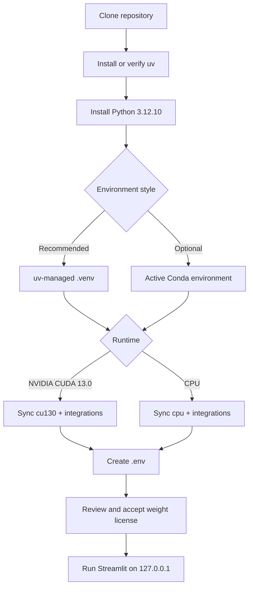

# 02 — Installation, Environments, and Credentials

[← Introduction](01_introduction.md) · [Tutorial index](../../README.md#zero-to-master-tutorial) ·
[Next: Data Handling →](03_data_handling.md)

This chapter creates a reproducible Python 3.12 environment, selects a CPU or CUDA runtime, and
configures optional Kaggle, Hugging Face, and MCP access. Commands are PowerShell-first; Bash
equivalents follow each platform-specific step.

> [!IMPORTANT]
> This repository uses **uv**, `pyproject.toml`, and `uv.lock` as its only dependency workflow.
> Do not create `requirements.txt` or install project packages with system `pip`.

## 1. Installation flow



## 2. Prerequisites

| Component | Required | Verification |
|---|---:|---|
| Git | Yes | `git --version` |
| uv | Yes | `uv --version` |
| Python 3.12.10 | Managed by uv or Conda | `python --version` |
| Free disk | 8 GB for one checkpoint; 16 GB recommended for both and cache | Check drive properties or `df -h` |
| NVIDIA driver | Only for CUDA runtime | `nvidia-smi` |
| Network | First dependency/model/provider download | Confirm HTTPS access to GitHub and Hugging Face |
| TabFM license acceptance | Before model loading | Review the [official license][tabfm-license] |

TabFM itself supports Python 3.11+, but this repository deliberately locks Python **3.12.10** for
reproducibility. uv creates a persistent `.venv` next to `pyproject.toml` and `uv run` executes
inside it ([uv project environments][uv-layout]).

## 3. Clone the workbench

### PowerShell

```powershell
Set-Location D:\AI
git clone https://github.com/pypi-ahmad/google-tabfm-project.git
Set-Location google-tabfm-project
```

### Bash

```bash
cd ~/projects
git clone https://github.com/pypi-ahmad/google-tabfm-project.git
cd google-tabfm-project
```

Verify that the lockfile and application entry point are present:

```powershell
Get-Item pyproject.toml, uv.lock, app.py
```

```bash
ls pyproject.toml uv.lock app.py
```

> [!NOTE]
> The expected repository URL becomes live after the GitHub repository is created. If you already
> have the source tree locally, enter that directory and continue at the next section.

## 4. Install uv and Python

Install uv using the platform method from the [official uv installation guide][uv-install]. On a
machine where uv is already available:

```powershell
uv self update
uv python install 3.12.10
uv python pin 3.12.10
```

```bash
uv self update
uv python install 3.12.10
uv python pin 3.12.10
```

`uv python pin` keeps `.python-version` aligned with the repository. It is already committed as
`3.12.10`; running the command is a verification step rather than a version change.

## 5. Choose an environment style

### Option A — uv-managed `.venv` (recommended)

No manual `python -m venv` call is needed. `uv sync` creates and synchronizes `.venv` from the
locked project metadata.

Choose exactly one runtime extra:

```powershell
# NVIDIA GPU with the repository's CUDA 13.0 PyTorch index
uv sync --locked --extra cu130 --extra integrations

# OR: CPU-only PyTorch
uv sync --locked --extra cpu --extra integrations
```

```bash
# NVIDIA GPU with the repository's CUDA 13.0 PyTorch index
uv sync --locked --extra cu130 --extra integrations

# OR: CPU-only PyTorch
uv sync --locked --extra cpu --extra integrations
```

The `cu130` and `cpu` extras conflict intentionally, preventing two PyTorch builds from entering
the same environment. `integrations` installs Kaggle, Hugging Face Hub, and MCP clients.

Activation is optional because `uv run` selects the environment automatically. If you prefer an
activated shell:

```powershell
.\.venv\Scripts\Activate.ps1
```

```bash
source .venv/bin/activate
```

The activation commands follow uv's documented project workflow
([uv projects guide][uv-projects]).

### Option B — Conda supplies Python, uv supplies dependencies

Use this only when your organization standardizes environment activation through Conda. Conda
creates the interpreter environment; uv remains the package resolver and uses the committed lock.

```powershell
conda create --name tabfm-workbench python=3.12.10 -y
conda activate tabfm-workbench
uv sync --active --locked --extra cpu --extra integrations
```

```bash
conda create --name tabfm-workbench python=3.12.10 -y
conda activate tabfm-workbench
uv sync --active --locked --extra cpu --extra integrations
```

Replace `--extra cpu` with `--extra cu130` only after confirming the NVIDIA driver/runtime path.
The uv `--active` flag prefers the currently activated environment
([uv CLI reference][uv-cli]). Without it, project commands default to `.venv`.

> [!WARNING]
> Do not combine `conda install`, `pip install`, and `uv sync` for the same project packages. That
> creates an environment whose installed state no longer corresponds to `uv.lock`.

## 6. Validate the Python and PyTorch runtime

```powershell
uv run python --version
uv run python -c "import torch; print(torch.__version__); print(torch.cuda.is_available())"
```

```bash
uv run python --version
uv run python -c 'import torch; print(torch.__version__); print(torch.cuda.is_available())'
```

Expected outcomes:

| Selected runtime | `torch.cuda.is_available()` | Meaning |
|---|---:|---|
| `cu130` with compatible NVIDIA driver | `True` | App can resolve `TABFM_DEVICE=auto` to CUDA |
| CPU extra | `False` | App resolves automatic device selection to CPU |
| `cu130` but `False` | Unexpected | Check driver, GPU visibility, and installed PyTorch build |

TabFM's first checkpoint load can take several minutes. Model files are automatically downloaded
from `google/tabfm-1.0.0-pytorch`; classification and regression are separate checkpoints
([official loader source][tabfm-loader]).

## 7. Create the environment file

Copy the committed template. The application does not automatically parse `.env`; the launch
command passes it explicitly through `uv run --env-file .env`.

```powershell
Copy-Item .env.example .env
```

```bash
cp .env.example .env
```

`.env` is gitignored. Keep it local, never paste it into issues, and never commit it.

### Configuration reference

| Variable | Default | Purpose |
|---|---|---|
| `TABFM_ACCEPT_NON_COMMERCIAL_LICENSE` | `false` | Enables model loading only after license review |
| `TABFM_DEVICE` | `auto` | `auto`, `cuda`, or `cpu` |
| `TABFM_MODEL_CACHE_DIR` | `data/cache/models` | Reserved; current TabFM loader uses the Hugging Face default cache |
| `TABFM_SESSION_TTL_HOURS` | `24` | Reserved; automatic session expiry is not currently implemented |
| `TABFM_MAX_UPLOAD_MB` | `500` | Per-file local upload limit |
| `TABFM_MAX_DOWNLOAD_MB` | `500` | Direct URL streamed download limit |
| `TABFM_ALLOW_INSECURE_HTTP` | `false` | Allows plain HTTP only when explicitly enabled |
| `HF_TOKEN` | Empty | Optional Hugging Face dataset access token |
| `KAGGLE_API_TOKEN` | Empty | Recommended non-interactive Kaggle token |
| `KAGGLE_USERNAME` | Empty | Legacy Kaggle credential pair, part 1 |
| `KAGGLE_KEY` | Empty | Legacy Kaggle credential pair, part 2 |
| `HF_MCP_URL` | Empty | Optional Hugging Face discovery MCP endpoint |
| `KAGGLE_MCP_URL` | Kaggle MCP URL | Optional Kaggle discovery endpoint |

Settings validate upload/download ranges and accepted device names when Streamlit starts. Empty
provider variables are valid; only the associated integration remains unauthenticated.

## 8. Review and acknowledge the model license

Read the [TabFM Non-Commercial License v1.0][tabfm-license]. It permits testing, evaluation, and
research not tied to commercial gain or production. It explicitly excludes revenue-generating
activity, production/end-user interaction, commercial decision-making, and commercial model
training/distillation.

Only after confirming your use is permitted, edit:

```dotenv
TABFM_ACCEPT_NON_COMMERCIAL_LICENSE=true
```

> [!CAUTION]
> This Boolean is a local safety gate, not a grant of rights and not legal advice. Setting it does
> not override the model license.

## 9. Configure Hugging Face access

The public TabFM checkpoint is currently ungated, so it can download without a token. A token is
needed for private or gated datasets and may improve authenticated rate-limit behavior.

### Create least-privilege access

1. Open [Hugging Face token settings][hf-tokens].
2. Create a dedicated **read** token, or a fine-grained token limited to required repositories.
3. If a dataset is gated, accept its access conditions in the browser using the same account.
4. Place the token in local `.env`:

```dotenv
HF_TOKEN=hf_your_local_read_token
```

Hugging Face documents `read` tokens as sufficient for downloading repositories you can access;
`write` is required only to create or modify repositories
([token roles][hf-token-roles]). The app passes `HF_TOKEN` directly to `HfApi` and
`hf_hub_download` and never displays its value.

### Diagnose Hugging Face authorization

| Symptom | Likely cause | Resolution |
|---|---|---|
| `401 Unauthorized` | Missing, malformed, expired, or revoked token | Recreate a read token and restart the app |
| `403 Forbidden` | Token lacks repository scope or gated access was not accepted | Grant fine-grained read access and accept dataset terms |
| Public search works; private repo is absent | Implicit token disabled or insufficient scope | Ensure `HF_TOKEN` is loaded and covers the repository |
| Dataset lists but file download fails | File/revision access differs | Confirm the selected file exists and account can read it |

## 10. Configure Kaggle access

The current Kaggle CLI supports OAuth, `KAGGLE_API_TOKEN`, an access-token file, and legacy
`kaggle.json` credentials ([official authentication guide][kaggle-auth]). This workbench supports
the recommended environment token and the legacy username/key methods.

### Option A — environment API token (recommended)

1. Open [Kaggle API settings][kaggle-settings].
2. Create/copy an API token.
3. Set it only in `.env`:

```dotenv
KAGGLE_API_TOKEN=your_local_kaggle_token
```

### Option B — legacy `kaggle.json`

From Kaggle settings, choose **Create Legacy API Key**. Move the downloaded JSON file into the
standard private directory.

PowerShell:

```powershell
$kaggleDirectory = Join-Path $HOME '.kaggle'
New-Item -ItemType Directory -Force -Path $kaggleDirectory | Out-Null
Move-Item -LiteralPath "$HOME\Downloads\kaggle.json" -Destination $kaggleDirectory
icacls "$kaggleDirectory\kaggle.json" /inheritance:r /grant:r "${env:USERNAME}:(R,W)"
```

Bash:

```bash
mkdir -p "$HOME/.kaggle"
mv "$HOME/Downloads/kaggle.json" "$HOME/.kaggle/kaggle.json"
chmod 600 "$HOME/.kaggle/kaggle.json"
```

The legacy file has this shape:

```json
{
  "username": "your-kaggle-username",
  "key": "your-legacy-api-key"
}
```

Do not copy real values into documentation, tests, or tracked files. Kaggle's Python client reads
the standard credential file during `KaggleApi.authenticate()`.

### Option C — legacy environment pair

If file credentials are disallowed by policy:

```dotenv
KAGGLE_USERNAME=your-kaggle-username
KAGGLE_KEY=your-legacy-api-key
```

Use one Kaggle method at a time to make failures diagnosable.

## 11. Optional MCP discovery

MCP is used only to discover dataset references. It does not replace native Kaggle or Hugging Face
downloads. Configure endpoints only when you trust the server:

```dotenv
HF_MCP_URL=https://trusted.example/mcp
KAGGLE_MCP_URL=https://www.kaggle.com/mcp
```

The app initializes a Streamable HTTP MCP session and will call only an allowlisted dataset-search
tool named `search_datasets`, `dataset_search`, or `list_datasets`. Provider SDKs perform actual
downloads.

## 12. Start the application

```powershell
uv run --env-file .env streamlit run app.py
```

```bash
uv run --env-file .env streamlit run app.py
```

Streamlit starts on `http://127.0.0.1:8501` by default. The committed configuration binds only to
loopback, caps uploads at 500 MB, disables telemetry, and uses polling file watching. The standard
CLI pattern is documented by Streamlit ([run an app][streamlit-run]). Stop it with `Ctrl+C`.

### Startup checklist

| Sidebar item | Healthy state |
|---|---|
| License | `Ready` after explicit acknowledgement |
| Device preference | Matches `.env`; automatic resolution occurs during model load |
| Hugging Face | `Ready` only when `HF_TOKEN` is present |
| Kaggle | `Ready` when environment credentials are present; file-only credentials may still authenticate on use |
| MCP endpoint | `Ready` for configured endpoint |
| Remote imports | HTTPS required unless insecure HTTP is explicitly enabled |

## 13. Common installation failures

| Failure | Diagnosis | Fix |
|---|---|---|
| uv chooses the wrong Python | `.python-version` ignored or Python missing | Run `uv python install 3.12.10` and `uv sync --locked` |
| PowerShell blocks activation | Execution policy prevents `Activate.ps1` | Use `uv run` without activation or apply an approved user-scope policy |
| `torch.cuda.is_available()` is false | CPU wheel or incompatible driver | Re-sync the `cu130` extra and verify `nvidia-smi` |
| Resolver reports conflicting extras | Both `cpu` and `cu130` were selected | Sync exactly one runtime extra |
| TabFM runtime import fails | Runtime extra was omitted | Add `--extra cpu` or `--extra cu130` |
| Model button remains blocked | License variable is false or `.env` was not passed | Review license, edit `.env`, launch with `--env-file .env` |
| First model load appears stalled | Multi-gigabyte checkpoint download | Check network/cache growth and wait; do not restart repeatedly |
| CPU prediction is extremely slow | Large transformer on CPU | Reduce context/test rows or use a compatible NVIDIA GPU |

## 14. Development verification

These checks do not download TabFM weights because model-facing tests use deterministic fakes:

```powershell
uv run pytest -p no:cacheprovider
uv run ruff check .
uv run mypy
```

```bash
uv run pytest -p no:cacheprovider
uv run ruff check .
uv run mypy
```

## Next step

Continue to [03 — Data Handling](03_data_handling.md) to import local and remote datasets while
preserving schema, provenance, and credential boundaries.

[hf-token-roles]: https://huggingface.co/docs/hub/security-tokens
[hf-tokens]: https://huggingface.co/settings/tokens
[kaggle-auth]: https://github.com/Kaggle/kaggle-cli/blob/main/docs/README.md#authentication
[kaggle-settings]: https://www.kaggle.com/settings/api
[streamlit-run]: https://docs.streamlit.io/develop/api-reference/cli/run
[tabfm-license]: https://huggingface.co/google/tabfm-1.0.0-pytorch/blob/main/LICENSE
[tabfm-loader]: https://github.com/google-research/tabfm/blob/cb6ba46b7ebc9a6581a81827e14e9c246202afb9/tabfm/src/pytorch/tabfm_v1_0_0.py
[uv-cli]: https://docs.astral.sh/uv/reference/cli/#uv-sync
[uv-install]: https://docs.astral.sh/uv/getting-started/installation/
[uv-layout]: https://docs.astral.sh/uv/concepts/projects/layout/
[uv-projects]: https://docs.astral.sh/uv/guides/projects/
