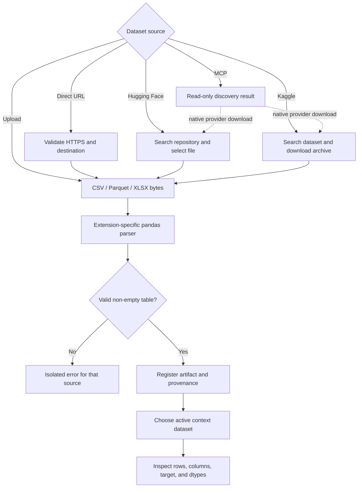
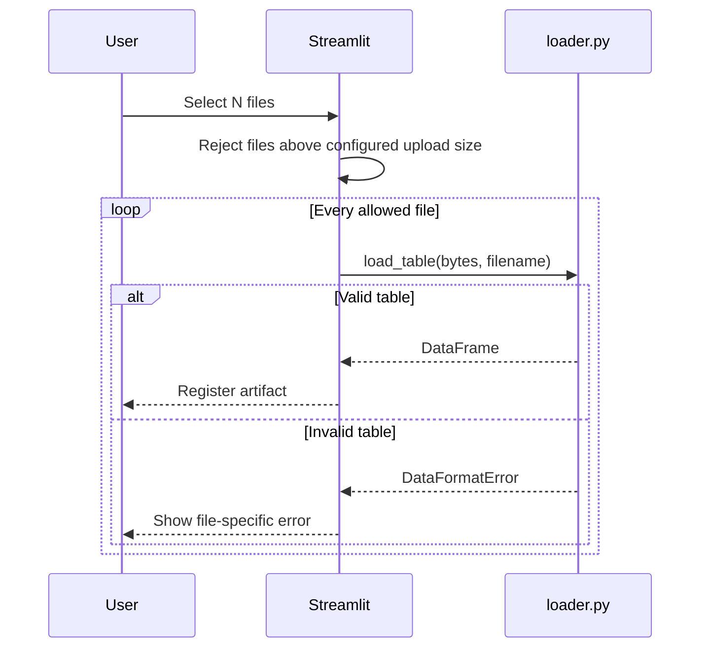
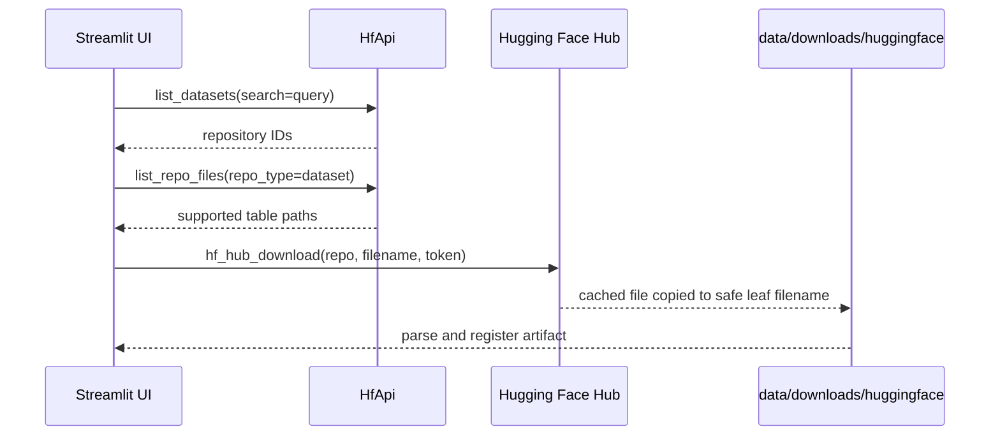
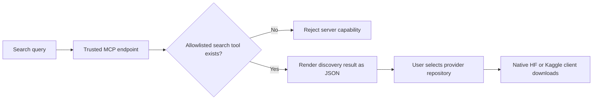

# 03 — Data Engineering and Dataset Ingestion

[← Installation](02_installation.md) · [Tutorial index](../../README.md#zero-to-master-tutorial) ·
[Next: TabFM Mastery →](04_tabfm_mastery.md)

TabFM receives a table, not a fixed feature schema designed by the model author. Data ingestion is
therefore part of the model contract: column names, dtypes, missing targets, and provenance all
affect what becomes context and what becomes a prediction request.

## 1. End-to-end ingestion flow



The application parses each uploaded file independently. One malformed file produces one visible
error; valid siblings remain available. Loaded tables are registered in Streamlit session state,
and the selected active artifact feeds the **Model** page.

## 2. Supported table formats

| Format | Extension | Parser | Strengths | Important behavior |
|---|---|---|---|---|
| CSV | `.csv` | `pandas.read_csv` | Portable, inspectable, broadly supported | Encoding/delimiter/type inference can be ambiguous |
| Apache Parquet | `.parquet` | `pandas.read_parquet` with PyArrow | Preserves typed columns; compact and fast | Requires valid Parquet metadata |
| Excel | `.xlsx` | `pandas.read_excel` with OpenPyXL | Familiar analyst workflow | Loads the first worksheet only |

The loader rejects unsupported extensions, zero-row tables, zero-column tables, duplicate column
names, and parser exceptions. File extensions select the parser; content sniffing is intentionally
not used.

> [!WARNING]
> A file renamed from `.json` to `.csv` does not become CSV. The selected parser will fail, and the
> app reports the parsing error without silently guessing another format.

## 3. Design a model-ready table

Use one row per observation and one column per feature. The target can be complete or partly blank,
depending on the prediction workflow.

| `age` | `city` | `joined_at` | `churned` |
|---:|---|---|---|
| 31 | Pune | 2024-01-10 | no |
| 47 | Mumbai | 2022-08-03 | yes |
| 29 | Pune | 2025-02-19 | *(blank)* |

If `churned` is selected as the target:

- the first two rows are labeled context;
- the third row is an unlabeled test case;
- `age`, `city`, and `joined_at` become features.

### Pre-import quality contract

| Check | Acceptable state | Why |
|---|---|---|
| Column names | Unique and stable | Prediction schemas align by name |
| Rows | At least two labeled rows to prepare a model | The workbench enforces two context examples |
| Features | 1–500 after dropping target | Workbench feature cap |
| Classification target | 2–10 unique labeled values | TabFM hard class limit |
| Regression target | Numeric labeled values | Metrics and checkpoint expect continuous numbers |
| Missing feature values | Allowed | Wrapper imputes/encodes; missing columns are explicitly warned |
| Target blanks | Intentional | They identify prediction rows in context-dataset mode |
| Identifiers | Remove if meaningless | High-cardinality IDs can add noise and memorize row identity |
| Leakage fields | Remove | Post-outcome columns invalidate evaluation |

## 4. Load multiple local files

1. Start the app and open **Data**.
2. Expand **Local files**.
3. Choose **Upload CSV, Parquet, or XLSX files**.
4. Select one or more files in the file picker.
5. Select **Parse uploaded files**.
6. Review individual errors and the registered artifacts.
7. Use **Active context dataset** to choose the table for modeling.



The default application limit is 500 MB per uploaded file. Streamlit's server-level
`maxUploadSize` and the app's `TABFM_MAX_UPLOAD_MB` check both apply. Raising only one may leave the
other as the effective limit ([Streamlit file uploader][streamlit-uploader]).

### Duplicate filenames

If two loaded artifacts share a filename, the application preserves both by appending a suffix:
`train.csv`, `train (2).csv`, and so on. Changing the active artifact invalidates any prepared
model context and prior predictions.

## 5. Import from a direct URL

Use this path for a direct link whose response body is a supported table—not a web page, landing
page, JavaScript download, or ZIP archive.

1. Expand **Direct URL**.
2. Paste an `https://` URL ending in `.csv`, `.parquet`, or `.xlsx`.
3. Select **Fetch URL**.
4. Inspect the active artifact preview and source label.

### Security boundary

Before sending a request, `remote.py` checks:

| Rule | Default behavior |
|---|---|
| Scheme | HTTPS only |
| Embedded username/password | Rejected |
| `localhost` | Rejected |
| Literal private, loopback, link-local, or reserved IP | Rejected |
| DNS name resolving to any non-global address | Rejected |
| Redirects | Disabled |
| Connect timeout | 30 seconds |
| Read timeout | 120 seconds |
| Declared/streamed body size | Capped by `TABFM_MAX_DOWNLOAD_MB` |

The file is streamed into memory, and both the `Content-Length` header and actual accumulated bytes
are checked. The filename comes from the URL path after percent decoding.

> [!CAUTION]
> DNS validation reduces server-side request-forgery risk but cannot fully eliminate DNS rebinding
> between resolution and connection. Direct URL ingestion is intended for a trusted local user,
> not an exposed multi-tenant service.

### Plain HTTP exception

Only for a trusted source that cannot provide TLS, set:

```dotenv
TABFM_ALLOW_INSECURE_HTTP=true
```

Restart the app. The sidebar displays a warning while HTTP is enabled. Return the setting to
`false` immediately after use because plain HTTP content can be modified in transit.

### URL troubleshooting

| Error | Meaning | Action |
|---|---|---|
| Only HTTPS allowed | HTTP was used without opt-in | Use HTTPS or explicitly enable trusted HTTP |
| Hostname could not be resolved | DNS failure | Verify spelling, DNS, and network access |
| Private/local URL rejected | Address is not globally routable | Download locally and use file upload instead |
| Request failed with 3xx | Server expects a redirect | Use the final direct asset URL |
| Unsupported file type | URL path has no supported suffix | Obtain a direct filename URL or upload locally |
| Exceeds size limit | Header or streamed body crossed the cap | Use a smaller extract or raise the reviewed local limit |
| Parser error | Response is not the declared table format | Open the URL separately and verify its content |

## 6. Retrieve datasets from Hugging Face Hub

The app uses the official `huggingface_hub` Python client. `HfApi.list_datasets` performs search,
`list_repo_files(..., repo_type="dataset")` enumerates files, and `hf_hub_download` downloads the
selected revision into the Hub cache
([Hugging Face API][hf-api], [download guide][hf-download]).

### UI workflow

1. Open **Data**, then expand **Hugging Face Hub**.
2. Enter a keyword such as `titanic`.
3. Select **Search Hugging Face**.
4. Choose a repository ID from **Dataset repository**.
5. Select **List Hugging Face files**.
6. Choose one listed `.csv`, `.parquet`, or `.xlsx` file.
7. Select **Download Hugging Face file**.
8. Inspect the newly registered artifact.



Nested repository paths are downloaded through the Hub client but copied into the workspace using
only their safe leaf filename. Path traversal names are rejected. If another artifact already has
that name, session registration adds a numerical suffix.

### Public, private, and gated datasets

| Repository type | Token requirement | Additional step |
|---|---|---|
| Public, ungated | Usually none | Token remains optional |
| Public, gated | Read/fine-grained token | Accept repository conditions in browser |
| Private | Token with read access | Account or organization must grant access |

The `HF_TOKEN` environment variable takes precedence over a locally stored Hub token
([Hub authentication][hf-auth]). A write token provides unnecessary privilege for this read-only
workflow.

## 7. Retrieve datasets from Kaggle

Kaggle datasets are addressed as `owner/dataset-slug`. Authentication occurs when the client calls
`KaggleApi.authenticate()`.

### UI workflow

1. Open **Data**, then expand **Kaggle**.
2. Enter a search term.
3. Select **Search Kaggle**.
4. Choose the dataset reference.
5. Select **List Kaggle files**.
6. Review the supported table files.
7. Select **Download Kaggle dataset**.
8. Inspect each supported file registered from the downloaded folder.

The current adapter downloads and unzips the complete dataset into
`data/downloads/kaggle/<owner_dataset>`, then registers only supported files returned by the file
listing. Account for the archive's total size, not only the selected table sizes. Kaggle's official
tutorial documents dataset search and download commands using the same API surface
([Kaggle dataset tutorial][kaggle-datasets]).

### Kaggle troubleshooting

| Symptom | Likely cause | Resolution |
|---|---|---|
| Search fails during authentication | No valid token source | Configure `KAGGLE_API_TOKEN` or legacy credentials |
| `401`/permission error | Expired or incorrect token | Rotate token and restart Streamlit |
| Dataset found but download denied | Terms/competition access missing | Accept required rules in the Kaggle browser UI |
| No supported files listed | Dataset contains ZIP/JSON/other formats only | Convert a local extract to CSV, Parquet, or XLSX |
| Disk usage is unexpectedly high | Entire dataset archive was downloaded | Remove unneeded files from the dedicated download folder after the session |

## 8. Discover via MCP

MCP support deliberately separates **discovery** from **download**.



1. Configure `HF_MCP_URL` or use the default `KAGGLE_MCP_URL`.
2. Open **MCP discovery**.
3. Select the provider and enter a query.
4. Select **Search MCP**.
5. Read the returned structured blocks.
6. Use the native provider section to search/download the chosen dataset.

The client calls only `search_datasets`, `dataset_search`, or `list_datasets`. It does not call MCP
write tools or accept an MCP-provided filesystem path. Treat endpoint results as untrusted text and
verify the provider reference before downloading.

## 9. Select and inspect the active artifact

After at least one successful import, **Active context dataset** controls the table used throughout
the application. The preview shows:

- row count;
- column count;
- source (`upload`, `url`, `huggingface`, or `kaggle`);
- the first 100 rows.

Changing the selection removes the prepared predictor, stored batch result, and stored single-row
result. This prevents a model prepared on dataset A from being used accidentally with dataset B.

### Local storage map

```text
data/
├── .gitkeep
├── cache/                   # model/runtime cache; gitignored
├── downloads/
│   ├── huggingface/         # copied Hub files; gitignored
│   └── kaggle/              # unzipped provider datasets; gitignored
├── sessions/
│   └── history/             # durable SQLite index and report ZIPs; gitignored
└── uploads/                 # reserved path; browser uploads are memory-only
```

Raw browser uploads remain in Streamlit session memory; the app does not copy them to `uploads/`.
Provider downloads are written under `data/downloads`. After a successful prediction, however,
submitted features, predictions, and metrics persist inside a report ZIP under
`data/sessions/history/bundles`, indexed by `data/sessions/history/history.sqlite3`. They remain
until **Clear history** permanently deletes the SQLite-indexed metadata first and then attempts
best-effort bundle removal; there is no automatic eviction. A locked ZIP may remain as an orphan,
so a cleanup warning does not guarantee sensitive-file erasure. Close processes holding warned
files, then manually remove those ZIPs or the history directory. `TABFM_HISTORY_DIR` can relocate
that durable history root. The `.gitignore` prevents these local data files from entering version
control, but it is not a privacy or access-control boundary.

## 10. Context rows versus test rows

The workbench supports two batch prediction patterns.

This context/test distinction follows TabFM's official examples, where `X_train`/`y_train` provide
in-context examples and `X_test` supplies new rows
([Google Research classification example][tabfm-classification-example]).

### Pattern A — blank targets in one table

```text
target present  ──→ labeled context
target missing  ──→ batch test row
```

This is convenient for a single workbook or CSV. The **Model** page uses all labeled rows for
preparation. **Predictions → Batch** later selects the blank-target rows.

### Pattern B — separate test file

Prepare context from the active labeled dataset, then upload another CSV, Parquet, or XLSX in
**Predictions → Batch**. If the test file contains the target column, nonblank labels are used for
metrics. The target is removed before inference. If it is absent, predictions run without metrics.

> [!WARNING]
> Do not include held-out labels in context and then report metrics on those same rows. That is
> leakage, not generalization measurement.

## 11. Schema alignment rules

The prepared context stores the ordered feature names. Prediction tables are aligned as follows:

| Test schema condition | Workbench behavior |
|---|---|
| Same names, different order | Reorder to context order |
| Missing context column | Add the column filled with nulls and show a warning |
| Extra test column | Drop it and show a warning |
| Duplicate test names | Reject prediction |
| No prediction rows | Stop with an informational warning |

Filling a missing feature with null allows the upstream imputer/encoder to handle it, but it is not
equivalent to having the original measurement. Treat the warning as a data-contract issue and
investigate before trusting the result.

## 12. Data validation playbook

| Question | Bad signal | Corrective action |
|---|---|---|
| Does each row represent one prediction unit? | Multiple event rows per entity without aggregation | Define observation grain first |
| Was every feature available at prediction time? | Outcome or post-outcome fields | Remove leakage columns |
| Are labels representative? | Only one class, severe temporal drift | Rebuild context and held-out samples |
| Are category values consistent? | `NY`, `New York`, `new_york` | Normalize before upload |
| Are missing values meaningful? | Sentinel strings mixed with nulls | Standardize missing representation |
| Are datetimes parseable? | Mixed locale formats | Normalize to ISO 8601 |
| Are identifiers predictive for the right reason? | Unique customer/order IDs | Remove unless semantically justified |
| Is evaluation independent? | Same rows in context and test | Use a true holdout or time split |

## 13. Worked ingestion example

Create a small local classification table:

```csv
age,plan,monthly_spend,joined_at,churned
31,basic,29.0,2024-01-10,no
47,pro,120.5,2022-08-03,yes
36,pro,97.2,2023-04-11,no
29,basic,18.5,2025-02-19,
```

Then:

1. save it as `churn.csv`;
2. upload and parse it;
3. select `churn.csv` as active;
4. verify four rows and five columns;
5. choose `churned` as the target in the next tab;
6. confirm three labeled context rows and one blank-target prediction row.

This tiny dataset demonstrates the flow, not model quality. Real evaluation needs representative
context and held-out data.

## Knowledge check

1. Why can a malformed workbook coexist with a valid CSV in the same upload action?
2. Why does MCP discovery not write a dataset into the workspace?
3. What happens if a separate test file omits a prepared feature?
4. Why might a direct URL to a GitHub “blob” page fail while its raw-content URL works?

Answers: files are parsed independently; MCP is intentionally discovery-only; the column is added
as null with a warning; and a blob page returns HTML rather than table bytes.

## Next step

Continue to [04 — TabFM Mastery](04_tabfm_mastery.md) to prepare context, run classification or
regression, evaluate metrics, and construct manual test cases.

[hf-api]: https://huggingface.co/docs/huggingface_hub/package_reference/hf_api
[hf-auth]: https://huggingface.co/docs/huggingface_hub/quick-start#authentication
[hf-download]: https://huggingface.co/docs/huggingface_hub/guides/download
[kaggle-datasets]: https://github.com/Kaggle/kaggle-cli/blob/main/docs/tutorials.md#datasets
[streamlit-uploader]: https://docs.streamlit.io/develop/api-reference/widgets/st.file_uploader
[tabfm-classification-example]: https://github.com/google-research/tabfm/blob/cb6ba46b7ebc9a6581a81827e14e9c246202afb9/examples/classification_example.py
