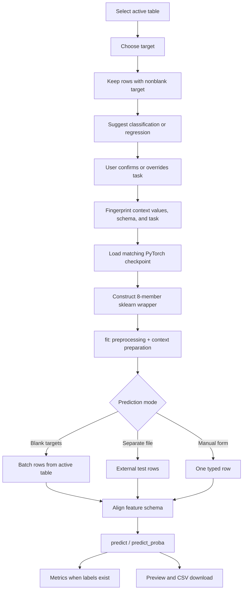
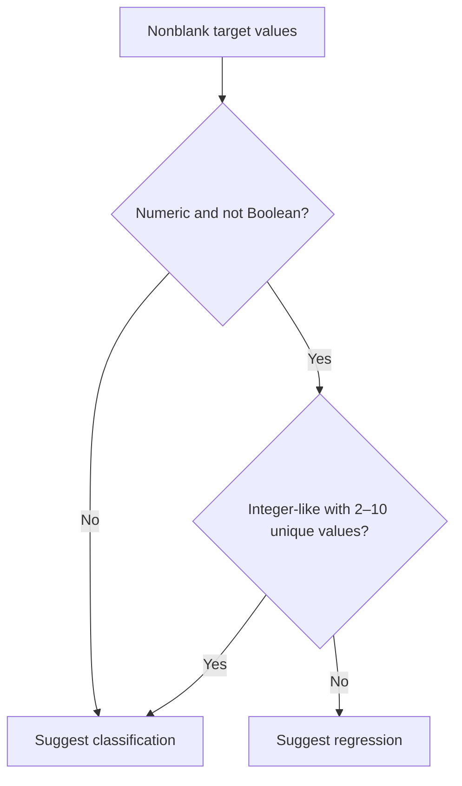
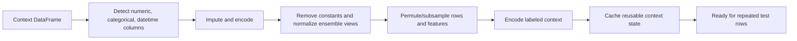
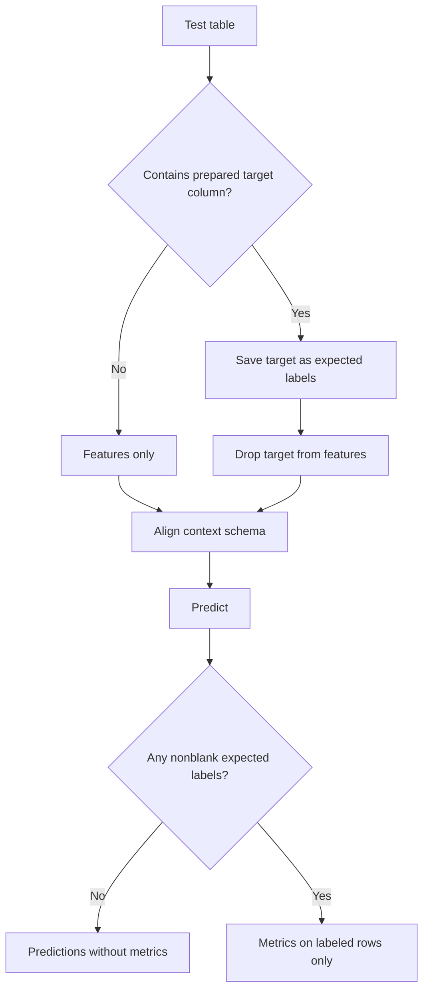
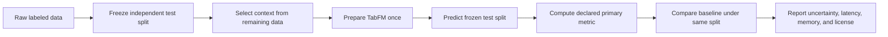

# 04 — TabFM Mastery: Context, Prediction, and Evaluation

[← Data Handling](03_data_handling.md) ·
[Tutorial index](../../README.md#zero-to-master-tutorial)

This chapter turns a validated table into classification or regression predictions. It explains
what the UI does, how the underlying Python sequence maps to the official TabFM API, and how to
decide whether the resulting metrics are trustworthy.

> [!IMPORTANT]
> In this repository, the **Model** page replaces the misleading phrase “training/fine-tuning.”
> TabFM's pretrained weights remain frozen. `fit()` prepares transformations and labeled context;
> it does not perform gradient descent or update model parameters
> ([official TabFM quick start][tabfm-readme]).

## 1. Prediction lifecycle



## 2. Choose the target and task

Open **Model** after selecting a dataset on **Data**.

1. Choose **Target column**.
2. Read the suggested task and rationale.
3. Confirm or override **Task type**.
4. Check context-row, feature, and target-value counts.
5. Select **Load TabFM and prepare context**.

### Task-suggestion heuristic

The helper examines nonblank targets:



This is deliberately a suggestion. An integer code such as `1`, `2`, `3` can represent categories,
while a small numeric target can still be continuous. Domain semantics override dtype heuristics.

| Target example | Suggested task | Reason |
|---|---|---|
| `yes`, `no` | Classification | Categorical values |
| `0`, `1` | Classification | Two integer-like values |
| `1`, `2`, `3`, `4`, `5` as satisfaction bands | Classification | Small bounded category set |
| `1.2`, `2.8`, `4.1`, `5.9` | Regression | Continuous-looking numeric values |
| Sale price in whole dollars | Regression | Many numeric values despite integer storage |

> [!WARNING]
> Choosing classification for an identifier-like integer column can create meaningless classes;
> choosing regression for category codes invents an ordering and distance that may not exist.

## 3. Context requirements

Before the upstream wrapper receives data, `PreparedPredictor.prepare()` enforces:

| Contract | Failure message/behavior |
|---|---|
| At least two labeled rows | Context preparation stops |
| At least one feature | Target-only table is rejected |
| No more than 500 features | Context preparation stops |
| Unique feature names | Duplicate schema is rejected |
| No missing context targets | Unlabeled rows stay outside context |
| Classification has 2–10 classes | Invalid class count is rejected |
| Regression target is numeric | Non-numeric labeled values are rejected |

The application fingerprints feature values, target values, dtypes, column order, and task. If any
of them change, the prepared predictor and prior results become stale and are invalidated.

## 4. Exact model-loading sequence

The workbench follows the official PyTorch/scikit-learn API with local resource settings:

```python
from tabfm import TabFMClassifier, TabFMRegressor, tabfm_v1_0_0_pytorch

model = tabfm_v1_0_0_pytorch.load(
    model_type="classification",  # or "regression"
    device="cuda",                # or "cpu"
)

options = {
    "model": model,
    "n_estimators": 8,
    "batch_size": 1,
    "max_num_features": 500,
    "max_num_rows": 5000,
    "random_state": 42,
    "cache_context": True,
    "maybe_quantize_kv_cache": True,
    "keep_cache_on_device": False,
}

estimator = TabFMClassifier(**options)
# For regression: TabFMRegressor(**options)

estimator.fit(context_features, context_target)
predictions = estimator.predict(test_features)
probabilities = estimator.predict_proba(test_features)  # classification only
```

The actual app wraps this sequence in `load_tabfm_predictor()` and `PreparedPredictor`. The
upstream loader defaults to bfloat16 compute, loads classification or regression weights from the
corresponding Hugging Face subfolder, places the model in evaluation mode, and caches identical
loads within the process ([official PyTorch loader][tabfm-loader]).

### Runtime options

| Option | Workbench value | Effect |
|---|---:|---|
| `n_estimators` | 8 | Creates diverse preprocessing/context views |
| `batch_size` | 1 | Limits simultaneous model inference batches |
| `max_num_features` | 500 | Subsamples/caps features per member |
| `max_num_rows` | 5,000 | Subsamples context per member |
| `random_state` | 42 | Makes stochastic ensemble configuration repeatable |
| `cache_context` | `True` | Reuses encoded context/KV state for repeated predictions |
| `maybe_quantize_kv_cache` | `True` | Reduces cache memory when supported |
| `keep_cache_on_device` | `False` | Allows context cache offload from accelerator |

These are local engineering defaults, not architectural maxima for every possible upstream use.
They trade some ensemble/context breadth for accessibility on an 8 GB-class GPU.

## 5. What `fit()` actually does

For this ICL model, “fit” means **prepare the prompt and preprocessing state**.



No optimizer, gradient tape, training epoch, learning rate, or checkpoint write appears in this
workflow. The official model card states that examples are passed as context and predictions are
made without fine-tuning or hyperparameter search ([model card][tabfm-model-card]).

### Preprocessing details

| Data component | Preparation |
|---|---|
| Numerical feature | Coerce/validate, mean-impute, normalize, clip outliers |
| Categorical feature | Ordinal-encode; map unknown/missing categories to sentinel value |
| Datetime feature | Parse to UTC-compatible timestamps; add year/month/day/weekday |
| Constant feature | Remove from model input |
| Classification target | Validate labels and encode classes |
| Regression target | Convert numeric, normalize, then invert model output |
| Ensemble member | Apply its normalization, feature order, class shift, and row sample |

The pinned implementation is the source of truth
([upstream wrapper source][wrapper-source]). Avoid manually one-hot encoding every category unless
an experiment specifically requires it; the wrapper is designed for mixed DataFrames.

## 6. Classification mastery

Classification returns a label and a probability for each learned class.

For logits $z_k$ across $K$ classes, softmax gives

$$
p_k=\frac{e^{z_k}}{\sum_{j=1}^{K}e^{z_j}},
\qquad \sum_{k=1}^{K}p_k=1.
$$

The predicted class is

$$
\hat{y}=\arg\max_k p_k.
$$

The workbench names probability columns from `classifier.classes_`, preserving numeric or string
labels. A binary output might look like:

| age | plan | prediction | probability_no | probability_yes |
|---:|---|---|---:|---:|
| 29 | basic | no | 0.78 | 0.22 |

### Classification metrics

**Accuracy** is the fraction of correct labeled predictions:

$$
\operatorname{Accuracy}=\frac{1}{N}\sum_{i=1}^{N}\mathbb{1}(\hat{y}_i=y_i).
$$

**Multiclass log loss** evaluates probability quality:

$$
\operatorname{LogLoss}=-\frac{1}{N}\sum_{i=1}^{N}\sum_{k=1}^{K}
\mathbb{1}(y_i=k)\log(p_{ik}).
$$

| Metric | Better direction | What it measures | Common trap |
|---|---|---|---|
| Accuracy | Higher | Top-label correctness | Can hide minority-class failure |
| Balanced accuracy | Higher | Mean recall across classes | Still hides which class failed |
| Macro precision/recall/F1 | Higher | Equal-weight class performance | Unstable with tiny class support |
| MCC | Higher (1 best) | Overall association across the confusion matrix | Undefined with fewer than two observed classes |
| Majority baseline accuracy/lift | Higher lift | Gain over always choosing the largest class | Baseline may still be inappropriate for asymmetric costs |
| Log loss | Lower | Probability calibration and confident mistakes | Sensitive to near-zero probability on true class |
| ROC-AUC | Higher | Ranking quality from probabilities | Undefined for incompatible/one-class labels |
| Evaluated rows | N/A | Number of usable, nonblank held-out labels compared | Small counts make metrics unstable |

The report also includes the confusion matrix, per-class precision/recall/F1/support, probability
diagnostics, and binary ROC curve data when defined. Log loss and ROC-AUC require compatible
probability classes; unavailable metrics become explicit warnings.

## 7. Regression mastery

Regression returns one continuous prediction $\hat{y}_i$ per test row.

### Mean absolute error

$$
\operatorname{MAE}=\frac{1}{N}\sum_{i=1}^{N}|y_i-\hat{y}_i|.
$$

MAE is measured in target units and weights each absolute error linearly.

### Root mean squared error

$$
\operatorname{RMSE}=\sqrt{\frac{1}{N}\sum_{i=1}^{N}(y_i-\hat{y}_i)^2}.
$$

RMSE emphasizes large errors because residuals are squared.

### Coefficient of determination

$$
R^2=1-\frac{\sum_i(y_i-\hat{y}_i)^2}{\sum_i(y_i-\bar{y})^2}.
$$

| Metric | Better direction | Interpretation |
|---|---|---|
| MAE | Lower | Typical absolute error in original units |
| RMSE | Lower | Error with stronger penalty for large misses |
| Median absolute error | Lower | Typical error resistant to a few large misses |
| Mean-baseline MAE/RMSE | Lower | Error from predicting the held-out mean |
| Mean-baseline MAE lift | Higher | Baseline MAE minus model MAE |
| R² | Higher | Improvement over predicting the held-out mean |
| Explained variance | Higher | Fraction of target variation explained |

R² can be negative when predictions are worse than the mean baseline. It is omitted for fewer than
two valid labeled rows or a constant target because variance comparison is not meaningful. The
report also contains actual-versus-predicted rows, residuals, and absolute-error quantiles.
MAE/RMSE depend on target scale, so compare them with the included baseline and domain tolerance.

## 8. Batch prediction: blank targets

Use this mode when context and test rows share one table.

1. Prepare context on **Model**.
2. Open **Predictions** and select **Batch**.
3. Select **Blank targets in context dataset**.
4. Confirm the prediction-row count.
5. Select **Run batch prediction**.
6. Inspect schema warnings, device, latency, output, and probabilities.
7. Select **Download predictions**.

Rows with nonblank targets prepared the model. Rows with blank targets are selected, the target is
removed, and remaining features are aligned to the context schema. No metrics appear because the
test rows have no labels.

> [!TIP]
> Preserve a stable row identifier in exported predictions only when it is needed for joining and
> cannot leak the target. TabFM will otherwise treat it as a feature.

## 9. Batch prediction: separate test file

1. Select **Separate test file**.
2. Upload a CSV, Parquet, or XLSX table.
3. If evaluation is desired, include the target column with held-out labels.
4. Select **Run batch prediction**.
5. Inspect metrics and download the result.



Partially labeled test files are supported. `evaluated_rows` reports how many aligned test rows had
usable labels. Predictions are still produced for all rows.

### Prevent evaluation leakage

| Leakage pattern | Why invalid | Correct design |
|---|---|---|
| Same rows in context and test | Model has seen their labels in context | Hold out rows before context preparation |
| Random split on temporal outcomes | Future information can enter past context | Use time-ordered context/test split |
| Feature calculated after outcome | Direct proxy for label | Restrict to prediction-time fields |
| Preprocessing fitted on full target-aware dataset | Test distribution informs context | Fit any custom preprocessing on context only |
| Selecting model after repeatedly viewing test metric | Test becomes tuning set | Keep a final untouched evaluation set |

## 10. Schema mismatch behavior

Prediction features are aligned to the exact prepared column order.

```text
Context columns: [age, plan, monthly_spend]
Test columns:    [plan, age, campaign]

Aligned input:   [age, plan, monthly_spend]
                              └─ filled with null
campaign ──────────────────────── ignored with warning
```

This permissive alignment keeps exploratory prediction moving, but warnings indicate data drift.
A missing column filled with null is not a neutral value; it flows through imputation/encoding and
can shift predictions. Production systems would normally enforce a stricter schema contract, but
production use of these weights is prohibited in any case.

## 11. Construct a manual case in Single mode

Open **Predictions** and select **Single** after context preparation. The form is derived from context feature
dtypes:

| Context dtype/shape | Widget | Default |
|---|---|---|
| Boolean | Select box | `False`/`True` choice |
| Numeric | Number input | Context median or `0.0` |
| Datetime | Date input | First nonblank context date or today |
| Categorical with ≤50 unique values | Select box | Known categories |
| Text/high-cardinality object | Text input | First nonblank context value or empty |

1. Enter a value for every feature.
2. Select **Predict single case**.
3. Inspect the predicted label/value and class probabilities.
4. Compare with domain expectations and nearby examples.

### Manual validation pattern

Build three kinds of cases:

| Case | Purpose | Example |
|---|---|---|
| Typical | Confirm ordinary behavior | Median numeric values and common categories |
| Boundary | Exercise known limits | Minimum/maximum plausible value |
| Counterfactual | Probe one feature's influence | Same row with only `plan` changed |

Manual cases are diagnostics, not a substitute for held-out metrics. A plausible prediction on one
row does not establish calibration, fairness, or generalization.

## 12. Read the result panel

Every result can contain:

| Element | Meaning |
|---|---|
| Alignment warnings | Missing columns filled or extra columns ignored |
| Metrics | Calculated only from available held-out labels |
| Device | `cuda` or `cpu` selected at model load |
| Inference latency | Time spent in estimator prediction calls, not upload/model-load time |
| Prediction column | Final class label or continuous value |
| Probability columns | Classification probability per `classes_` label |
| CSV download | Submitted feature rows plus predictions/probabilities |
| Report bundle | Automatically generated ZIP after a successful prediction action |

Latency is measured per action after context preparation. First-call warm-up, checkpoint loading,
browser rendering, and provider downloads are outside that number.

The report ZIP contains exactly `report.html`, `report.pdf`, `predictions.csv`, and `metrics.json`.
Open **EDA & Reports** for deterministic charts capped at 10,000 rows (5,000 for scatter and 20
numeric columns for correlations), and use **History** to browse 10 saved runs per page and download
older available bundles.

## 13. Failure modes and recovery

| Failure | Cause | Recovery |
|---|---|---|
| “Prepare a model context first” | No current prepared signature | Return to Model and prepare |
| License warning blocks button | Acknowledgement is false | Review license, set variable, restart app |
| Classification requires 2–10 classes | One or >10 labeled classes | Correct target/task or use another model |
| Regression target must be numeric | Text or malformed numbers | Clean target and reload |
| More than 500 features | Wide schema | Remove noise/leakage or reduce dimensions before upload |
| CUDA out of memory | Context/test/ensemble too large | Restart, reduce rows/features/test batch, or use larger GPU |
| CPU appears hung | Transformer inference is slow | Start with tiny data; use compatible CUDA when possible |
| Missing-column warning | Test schema drift | Restore feature or verify imputation is acceptable |
| Extra-column warning | Context lacks a test feature | Reprepare with intended schema or remove the extra field |
| Metrics absent | No usable labels or incompatible probability classes | Include aligned held-out target labels |
| Old result after input edit | Streamlit state or prepared signature mismatch | Reprepare context and rerun prediction |

Use the reset action that matches your intent:

| Action | Removes | Retains |
|---|---|---|
| **Clear loaded datasets** | Loaded tables plus all in-memory model/prediction state derived from them | Provider downloads, model cache, permanent history |
| **Start new task** | Target/task inputs, prepared context, predictions, and current report references | Loaded datasets, provider downloads, model cache, permanent history |
| **Clear history** | After confirmation, SQLite-indexed metadata first, then best-effort report ZIP cleanup | Loaded datasets, current in-memory task, provider downloads, model cache; locked ZIPs may remain orphaned |

History is permanent local storage under `TABFM_HISTORY_DIR` (default
`data/sessions/history`), has no automatic eviction, and shows 10 newest-first runs per page.
Because report bundles contain submitted features, predictions, metrics, and dataset details, do not
use sensitive data unless this on-disk persistence and the workstation's access controls are
acceptable. A `failed` run means prediction succeeded but report persistence did not; an
`unavailable` run has malformed metadata or a missing, corrupt, or unsafe bundle and cannot be
downloaded. If the UI warns that cleanup was incomplete, close processes holding the warned files
and manually remove those orphan ZIPs or the history directory; **Clear history** alone does not
guarantee erasure of locked sensitive files.

## 14. Memory and performance tuning

Approximate inference cost grows with context rows $n$, test rows $t$, model width $d$, and ensemble
members $M$. Exact complexity depends on TabFM's compressed attention/cache path, but these levers
remain practical:

| Lever | Lower-resource setting | Tradeoff |
|---|---|---|
| Context rows | Smaller representative subset | May lose rare patterns |
| Features | Remove leakage, IDs, constants, redundant fields | Poor selection can remove signal |
| Test rows per action | Smaller files/batches | More user actions and output joins |
| Ensemble members | Fixed at 8 in this app | Code change required; fewer views may reduce robustness |
| Device | CUDA | Requires compatible NVIDIA hardware and driver |
| Context cache | Enabled with possible quantization/offload | Optimizes repeated predictions after preparation |

The app logs task, test-row count, feature count, latency, and device at the prediction boundary. It
does not log raw tables, labels, predictions, or credentials.

## 15. Fine-tuning: current boundary and future note

### Supported today

- frozen TabFM v1.0.0 classification/regression weights;
- wrapper preprocessing and in-context adaptation;
- deterministic ensemble inference;
- repeated batch and single-row prediction against cached context.

### Not supported today

- gradient-based updates to TabFM weights;
- adapters, LoRA, or partial-layer tuning;
- optimizer/epoch/loss configuration;
- saving a dataset-specialized checkpoint;
- distributing a derivative model.

The model card lists tasks requiring task-specific fine-tuning as not intended
([official limitations][tabfm-model-card]). The weight license also defines customized,
fine-tuned, or retrained versions as derivatives and restricts use/distribution
([official weight license][tabfm-license]).

### What a future research proposal would need

A future upstream-supported fine-tuning path would require, at minimum:

1. explicit legal permission for the intended derivative and use;
2. an official trainable checkpoint/API rather than inference-only assumptions;
3. leakage-safe train/validation/test splits and a task-specific loss;
4. optimizer, precision, memory, checkpoint, and reproducibility design;
5. catastrophic-forgetting and calibration evaluation against frozen ICL;
6. derivative-model storage and distribution controls.

This is an architectural roadmap, not an executable workflow. Do not reinterpret `fit()` as
fine-tuning or add unsupported training commands to this repository.

## 16. Evaluation protocol for credible results



Use this checklist:

| Decision | Record before evaluation |
|---|---|
| Prediction unit | What one row represents |
| Split method | Random, grouped, or temporal—and why |
| Primary metric | Metric aligned with business/research cost |
| Context size | Number of labeled rows shown to TabFM |
| Baseline | Naive predictor and/or tuned GBDT |
| Random seed | Split and baseline seeds |
| Hardware | CPU/GPU and memory |
| TabFM configuration | Task, ensemble count, row/feature caps |
| Exclusions | Leakage fields and removed identifiers |
| License scope | Research/evaluation purpose only |

For small held-out sets, use confidence intervals or repeated splits where appropriate. Do not
claim superiority from one convenient split.

## 17. Worked classification walkthrough

Using the `churn.csv` example from Chapter 3:

1. choose `churned` as target;
2. accept classification because labels are `yes`/`no`;
3. confirm three labeled context rows and four features;
4. prepare the classification checkpoint;
5. select blank-target batch mode;
6. predict the fourth row;
7. inspect `prediction`, `probability_no`, and `probability_yes`;
8. export CSV.

With only three context rows, the result validates integration—not quality. A serious experiment
needs enough representative context and independently labeled test rows.

## 18. Worked regression walkthrough

Suppose a house-price table contains `square_feet`, `neighborhood`, `age_years`, and `sale_price`:

1. choose `sale_price` as target;
2. confirm or override to regression;
3. ensure every context price is numeric;
4. prepare the regression checkpoint;
5. upload a separate labeled test table;
6. run batch prediction;
7. interpret MAE and RMSE in currency units and R² against the held-out mean;
8. compare with a mean baseline and a GBDT on the identical split.

If RMSE is much larger than MAE, a small number of large misses may dominate. Inspect those rows
before drawing conclusions.

## 19. Mastery checklist

You are ready to use the workbench responsibly when you can answer “yes” to each statement:

- I can explain why TabFM `fit()` does not update weights.
- I selected classification/regression from target semantics, not dtype alone.
- My context and held-out test rows do not overlap.
- Every test feature was available at real prediction time.
- I investigated every missing/extra-column warning.
- I compare metrics with a baseline and understand their scale.
- I recorded context size, configuration, device, and latency.
- My use is non-commercial, non-production, and permitted by the weight license.

## References

- [Official TabFM repository and quick start][tabfm-readme]
- [Official PyTorch model card][tabfm-model-card]
- [Official PyTorch loader implementation][tabfm-loader]
- [Official classifier/regressor wrapper source][wrapper-source]
- [TabFM Non-Commercial License v1.0][tabfm-license]
- [Scikit-learn model evaluation guide][sklearn-evaluation]

[sklearn-evaluation]: https://scikit-learn.org/stable/modules/model_evaluation.html
[tabfm-license]: https://huggingface.co/google/tabfm-1.0.0-pytorch/blob/main/LICENSE
[tabfm-loader]: https://github.com/google-research/tabfm/blob/cb6ba46b7ebc9a6581a81827e14e9c246202afb9/tabfm/src/pytorch/tabfm_v1_0_0.py
[tabfm-model-card]: https://huggingface.co/google/tabfm-1.0.0-pytorch
[tabfm-readme]: https://github.com/google-research/tabfm/tree/cb6ba46b7ebc9a6581a81827e14e9c246202afb9#quick-start-tabfm-v100
[wrapper-source]: https://github.com/google-research/tabfm/blob/cb6ba46b7ebc9a6581a81827e14e9c246202afb9/tabfm/src/classifier_and_regressor.py
